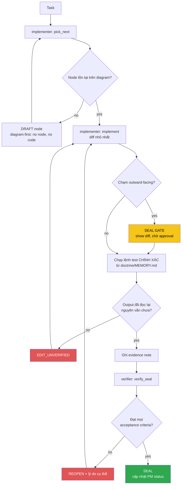

<!-- Diagram: dev-loop -->
<!-- Dev loop: plan - implement - verify - seal -->
DNA: 'smallest_diff / edit_x_read_back_proof_x_independent_verdict'
Auth: 65537 | Version: 1.0.0
Law: LAI-13 - monotonic ratchet (PENDING -> IN_PROGRESS -> SEALED, never demote)

> Mọi thay đổi tới repo code đi vào đây và đi ra bằng SEALED hoặc REOPENED —
> không có trạng thái nào khác ở giữa.

## PM status
| Node | State | Notes |
|---|---|---|
| `fix-chrome-executable-path` | PENDING | `src/services/createPDF.ts:14-25` — Chrome executable path hardcoded, breaks PDF export in CI/Docker. Xem `doctrine/domains/PROJECT.md` Traps. Ứng viên candidate node đầu tiên. |
| `fix-redis-init-blocks-dev-startup` | PENDING | `src/services/redis.ts:36` — `await redisClient.connect()` không timeout; redis v4 default `reconnectStrategy: retries => Math.min(retries*50,500)` retry vô hạn khi Redis không chạy. `server.ts:125` `await initRedis()` trước `app.listen()` → server treo vĩnh viễn, không bao giờ mở port, khi `REDIS_URL` trỏ tới Redis không reachable. Phát hiện khi chạy `npm run dev` thật (task: "chạy npm run dev và giải quyết bug"). |
| `fix-idor-broken-access-control` | PENDING | **Critical.** Toàn bộ CRUD API cho candidate_profile (education/experience/award/certificate/project/reference/generalInformation) + `candidate.service.ts` + `fnExportPDF` không đối chiếu `candidateId`/`_id` với `req.user._id` (JWT) — tin `req.body.candidateId`/`_id` do client tự gửi. Live-test xác nhận: User B đọc/xoá/sửa được dữ liệu của User A, ghi đè được profile của A. Root cause: `verifyToken.middleware.ts` set `req.user` nhưng không cross-check. Phát hiện khi test toàn bộ API (task: "test lại toàn bộ API"). |
| `fix-candidate-password-leak` | PENDING | `src/candidate/candidate.service.ts` — `handlerGetInformationByEmail` không `.select()` gì; `handlerGetInformationById` có bug double-wrap `whitelistSelect([select])` khiến select luôn no-op. Kết quả: `GET /api/v1/candidate/:email` và `PUT/PATCH /candidate/update` trả nguyên bcrypt password hash trong response. |
| `fix-refresh-token-expiry-unused` | PENDING | `TOKEN_EXP_IN` (`.env`, config đã export) không hề được dùng ở `jwtSign()` call site nào (`auth.service.ts`, `auth.controller.ts`, `api/v1/auth/services/login.ts`) — access token và refresh token luôn cùng default 1h, refresh token mất tác dụng. |
| `fix-v2-register-missing-await` | PENDING | `src/api/v1/auth/services/register.ts:44` — `bcryptGenerateSalt(password)` thiếu `await`, Promise được gán thẳng vào field password của Mongoose model → mọi request `POST /api/v2/auth/register` fail với lỗi cast Promise→string. |
| `fix-create-response-null-id` | PENDING | Minor. `BaseService.ts` `handlerCreate`'s `hookAfterSave` reassign biến `data` cục bộ (destructured), không thực sự cập nhật giá trị trả về của `baseCreateDocument` → response của mọi `POST .../create` trả `data._id: null` thay vì ID thật vừa tạo. |
| `add-candidate-self-delete` | PENDING | Feature (không phải bug). Không có endpoint nào để candidate tự xoá tài khoản — cần để dọn 2 account test tạo ra khi live-verify 5 fix bug trên production (`livecheck+...@example.com`, `livecheckB+...@example.com`). Yêu cầu: `DELETE /api/v1/candidate`, chỉ dùng `req.user._id` (không nhận id từ client — theo đúng pattern IDOR-safe của `fix-idor-broken-access-control`), cascade xoá luôn data ở 7 CV section model theo `candidateId`. |
| `feat-multilang-resume-content` | PENDING | Feature, GitHub issue #79. Localize 8 field mô tả tự do (`Candidate.introduction`, `description` ở 5 CV section, `generalInformation.career`/`careerGoal`) từ `String` phẳng sang `{vi, en}`. KHÔNG đụng field tên riêng/label ngắn (`school`/`company`/`position`/`positionDesired`/`levelCurrent`/...). `?lang=` resolve về string đơn cho `GET /api/me/:email` + PDF export; authenticated CRUD trả nguyên `{vi,en}`. Migration script `src/scripts/migrate-localize-text-fields.ts` (`npm run migrate:localize-text`), idempotent — đã chạy thật, xác nhận qua evidence. **Correction**: note cũ ở đây từng ghi "không có quyền truy cập DB production" — SAI, `.env` local thực chất trỏ tới cùng cluster Atlas real data (xem node `fix-candidate-me-candidateid-not-string`). |
| `fix-candidate-me-candidateid-not-string` | PENDING | **Critical, phát hiện tình cờ khi test #79.** `candidate_me/index.ts` `handlerGetAboutMe` — `_id` lấy từ raw Mongoose document là ObjectId instance, truyền thẳng vào `idQuerySafe.safeQuery({}, { candidateId: _id })` — `QuerySafe.safeQuery` chỉ nhận `typeof value === 'string'`, ObjectId fail check này nên `candidateId` bị âm thầm loại khỏi filter → `model.find({})` trả về data CV (education/experience/award/certificate/project/generalInformation) của **TẤT CẢ candidate trộn lẫn**, cho MỌI request `GET /api/me/:email` (public, no-auth) và `/download-pdf`. Live-test xác nhận: profile candidate mới toanh trả về data thật của `votan.it@gmail.com`. Fix: `.toString()` khi truyền `_id`. |

Any regression phải là **node mới** (LAI-13) — không được sửa trực tiếp PM
status của node cũ để "gỡ" một SEAL đã có.
