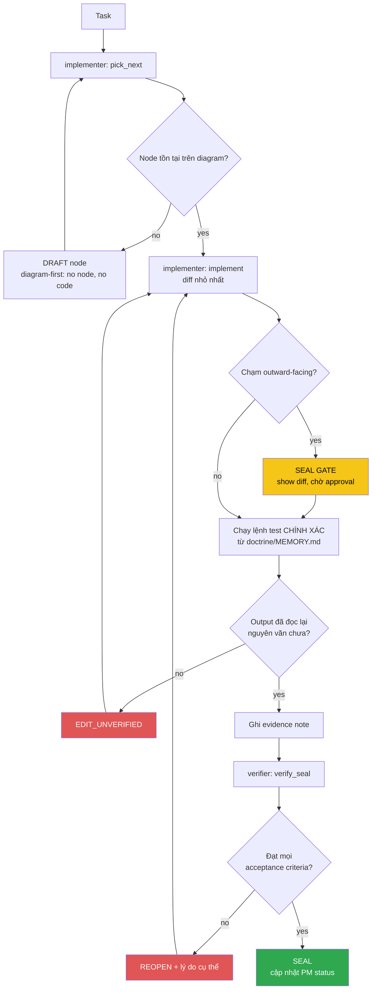

<!-- Diagram: dev-loop -->
<!-- Dev loop: plan - implement - verify - seal -->
DNA: 'smallest_diff / edit_x_read_back_proof_x_independent_verdict'
Auth: 65537 | Version: 1.0.0
Law: LAI-13 - monotonic ratchet (PENDING -> IN_PROGRESS -> SEALED, never demote)

> Mọi thay đổi tới repo code đi vào đây và đi ra bằng SEALED hoặc REOPENED —
> không có trạng thái nào khác ở giữa.

## PM status
| Node | State | Notes |
|---|---|---|
| `fix-chrome-executable-path` | PENDING | `src/services/createPDF.ts:14-25` — Chrome executable path hardcoded, breaks PDF export in CI/Docker. Xem `doctrine/domains/PROJECT.md` Traps. Ứng viên candidate node đầu tiên. |

Any regression phải là **node mới** (LAI-13) — không được sửa trực tiếp PM
status của node cũ để "gỡ" một SEAL đã có.
