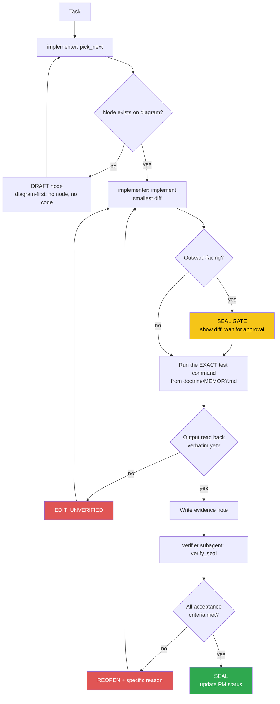

<!-- Diagram: dev-loop -->
<!-- Dev loop: plan - implement - verify - seal -->
DNA: 'smallest_diff / edit_x_read_back_proof_x_independent_verdict'
Auth: 65537 | Version: 1.0.0
Law: LAI-13 - monotonic ratchet (PENDING -> IN_PROGRESS -> SEALED, never demote)

> Every repo code change enters here and exits as SEALED or REOPENED — no
> other state exists in between.

```mermaid
flowchart TD
    task[Task] --> pick[implementer: pick_next]
    pick --> exist{Node exists on diagram?}
    exist -- no --> draft[DRAFT node<br/>diagram-first: no node, no code]
    draft --> pick
    exist -- yes --> impl[implementer: implement<br/>smallest diff]
    impl --> outward{Outward-facing?}
    outward -- yes --> gate[SEAL GATE<br/>show diff, wait for approval]
    gate --> test
    outward -- no --> test[Run the EXACT test command<br/>from doctrine/MEMORY.md]
    test --> readback{Output read back<br/>verbatim yet?}
    readback -- no --> unverified[EDIT_UNVERIFIED]
    unverified --> impl
    readback -- yes --> evidence[Write evidence note]
    evidence --> verifier[verifier subagent: verify_seal]
    verifier --> verdict{All acceptance<br/>criteria met?}
    verdict -- no --> reopen[REOPEN + specific reason]
    reopen --> impl
    verdict -- yes --> seal[SEAL<br/>update PM status]

    classDef gate fill:#f5c518,color:#000
    classDef bad fill:#e05555,color:#fff
    classDef good fill:#2fa84f,color:#fff
    class gate gate
    class unverified,reopen bad
    class seal good
```

## PM status
> Older SEALED nodes (2026-08-22 through 2026-08-25; then a 2nd pass
> 2026-08-30 covering 7 more nodes dated 2026-08-29/2026-08-30; then a
> 3rd pass 2026-09-03 covering the 4 remaining full-content SEALED rows,
> dated 2026-08-30 through 2026-09-02) moved to
> `haven/diagrams/dev-loop-archive.md` to keep this file small — every
> worker session reads this file in full. Nothing deleted: the archive
> has each row's full original text verbatim. The compact rows below
> point to it; open the archive only when you need the full story
> behind an old node. `pick_next` only needs non-archived rows. Run
> `/hub-tokens` periodically — if this file flags >15KB again, repeat
> this archiving pass for nodes older than the current work session.

| Node | State | Notes |
|---|---|---|
| `add-docx-export-format` | SEALED | 2026-09-02 — archived, see `haven/diagrams/dev-loop-archive.md`. Evidence: `evidence/implementer/2026-09-02/add-docx-export-format-diff.md`. |
| `add-pagination-filtering-cv-sections` | SEALED | GitHub issue #73. `page`/`limit`/`sort` query params on the 6 CV-section list endpoints (education/experience/award/certificate/project/reference — `generalInformation` excluded, its `GET /` returns a single document, not a list). Code already implemented and merged to `staging` via PR #106 (commit `1133f1b`, 2026-09-02) with no matching diagram node/evidence note at the time (bookkeeping gap, backfilled now by `/todo "#73"`, same pattern as `add-logout-all-sessions`/#74). Opt-in and backward compatible: omitting `limit` returns the exact old unpaginated array (`services/index.ts` `baseFindDocument`); a valid `limit` (capped at 100, `MAX_PAGE_LIMIT`) switches `data` to `{ items, pagination }`. `sort` validated against `SORT_FIELD_REGEX` allowlist in `BaseController.ts` — no `$`, can't smuggle a Mongo operator. Issue stays OPEN on GitHub because the merge landed on `staging`, not the default branch (`main`) — same expected auto-close gap as #74, not a bug. Verified 2026-09-05, evidence: `evidence/verifier/2026-09-05/add-pagination-filtering-cv-sections-seal.md`. |
| `add-logout-all-sessions` | SEALED | GitHub issue #74. `POST /api/v1/auth/logout-all` — code already implemented and merged to `staging` via PR #105 (commit `03bcb66`, 2026-09-02) with no matching diagram node/evidence note at the time (bookkeeping gap, backfilled now by `/todo "#74"`). Design deviates from the issue's `tokenVersion`-on-`Candidate` proposal: reuses the Redis/mem "invalidated-before" timestamp shape from `tokenBlacklist.ts` (`src/utils/sessionRevocation.ts`), compared against the JWT's standard `iat` in `verifyToken.middleware.ts` + `authRefreshToken` — no schema change, no extra Mongo lookup. Issue stays OPEN on GitHub because the merge landed on `staging`, not the default branch (`main`); auto-close via `Closes #74` fires only on a `main` merge per the documented release workflow — expected, not a bug. Verified 2026-09-05, evidence: `evidence/verifier/2026-09-05/add-logout-all-sessions-seal.md`. |
| `agent-hub-token-cleanup-20260830` | SEALED | 2026-08-30 — archived, see `haven/diagrams/dev-loop-archive.md`. Evidence: `evidence/implementer/2026-08-30/agent-hub-token-cleanup-diff.md`. |
| `fix-chrome-executable-path` | SEALED | GitHub issue #154. Bookkeeping-gap backfill, same pattern as `fix-create-response-null-id`/`fix-idor-broken-access-control`: reading `src/services/createPDF.ts` today shows **no hardcoded Chrome executable path** anywhere — `process.env.PUPPETEER_EXECUTABLE_PATH` conditionally spread into the launch options, falling back to Puppeteer's own bundled-Chromium resolution when unset. This exact shape was introduced by `add-docker-support`/#24 (SEALED 2026-09-06) and has been Docker-live-verified since — that node's own row explicitly calls out this trap as already fixed. The doctrine `Traps` table entry describing the old hardcoded path is now stale (out of scope here, flagged for a future docs-only pass). The real remaining gap this node closed: `services/createPDF.test.ts` had zero coverage of the executable-path resolution logic itself. 0 production changes; `src/__tests__/services/createPDF.test.ts` extended with a new `createCV executablePath resolution (issue #154)` describe block — 2 tests (`PUPPETEER_EXECUTABLE_PATH` unset → bundled Chromium, no `executablePath` key; set → override honored), `jest.mock('puppeteer', ...)` so no real browser spawns. `npm test`: 142/142 passed. SEALED 2026-09-28 after independent verifier pass (audit-only, no re-run — note's `npm test` output was verbatim, not truncated, command matched `doctrine/MEMORY.md`; independently confirmed the no-hardcoded-path claim by reading `createPDF.ts`, confirmed the 2 new tests via `git diff` on the test file, confirmed `PUPPETEER_EXECUTABLE_PATH`/Docker-live-verification claim via `add-docker-support`'s own sealed row; confirmed via `git status --short` on `154-puppeteer-chrome-executable` that nothing was committed/pushed). Evidence: `evidence/implementer/2026-09-28/fix-chrome-executable-path-plan.md`, `evidence/verifier/2026-09-28/fix-chrome-executable-path-seal.md`. |
| `fix-idor-broken-access-control` | SEALED | **Critical.** All CRUD APIs for candidate_profile (education/experience/award/certificate/project/reference/generalInformation) + `candidate.service.ts` + `fnExportPDF` never cross-check `candidateId`/`_id` against `req.user._id` (JWT) — they trust client-supplied `req.body.candidateId`/`_id`. Live-tested confirmed: User B could read/delete/edit User A's data, overwrite A's profile. Root cause: `verifyToken.middleware.ts` sets `req.user` but nothing cross-checks it. Found while testing the full API (task: "test the whole API again"). Code already fixed on `staging` (commit `f355e2f`, folded in via `1ec67de`'s ancestry) — bookkeeping-gap backfill, same pattern as #73/#74: `verifyToken.middleware.ts` forces `req.body.candidateId` to the authenticated `_id`; `baseUpdateDocument`/`baseDeleteDocument` check the existing document's real owner, not the payload; `candidate.controller.ts` forces `value._id`; `candidate_me/index.ts` `fnExportPDF` uses `req.user._id` directly. SEALED 2026-09-08 after independent re-read of every cited file (router, middleware, services/index.ts, BaseController/BaseService, candidate.controller.ts, candidate_me/index.ts, generalInformation.controller.ts) — evidence: `evidence/verifier/2026-09-08/fix-idor-broken-access-control-seal.md`. |
| `fix-candidate-password-leak` | PENDING | `src/candidate/candidate.service.ts` — `handlerGetInformationByEmail` has no `.select()` at all; `handlerGetInformationById` double-wraps `whitelistSelect([select])`, making the select a permanent no-op. Result: `GET /api/v1/candidate/:email` and `PUT/PATCH /candidate/update` return the raw bcrypt password hash in the response. |
| `fix-refresh-token-expiry-unused` | SEALED | GitHub issue #155. Backfill, same pattern as `fix-idor-broken-access-control`/`fix-create-response-null-id`: the node's own PENDING description cited `api/v1/auth/services/login.ts`, a file removed/merged by `consolidate-v1-v2-auth` (SEALED 2026-08-29) — stale. Re-reading the real call sites shows `TOKEN_EXP_IN` IS already passed at both `jwtSign()` sites (`src/auth/auth.service.ts:126-127` `handlerLogin`, `src/auth/auth.controller.ts:153-154` `authRefreshToken`, both `{ expiresIn: TOKEN_EXP_IN || '1h' }` for access / `{ expiresIn: TOKEN_REFRESH_EXP_IN }` for refresh), part of the same bundled commit `f355e2f` (2026-08-21) as the other 2 bookkeeping-gap nodes sealed this session — never backfilled on the diagram until now. The real remaining gap this node closed: no test decoded a real issued JWT to prove `exp - iat` actually reflects the configured duration (the mocked `auth.service.test.ts` assertion would pass even with the wrong config var or shared access/refresh lifetimes) — exactly what issue #155's acceptance criteria calls for. 1 new test file (`src/__tests__/auth/tokenExpiry.test.ts`), 0 production changes — proportionate given the fix is already live. Uses real unmocked `jwtSign`/`jwtVerify` + real config, `jest.resetModules()`-and-re-`require()`'d per test so env var changes actually take effect: asserts `TOKEN_EXP_IN='2h'` → access `exp-iat===7200`, `TOKEN_REFRESH_EXP_IN='14d'` → refresh `exp-iat===1209600` (2 distinct config-driven lifetimes, not a shared default), plus 2 regression checks (`TOKEN_EXP_IN` unset → 1h fallback; `TOKEN_REFRESH_EXP_IN` unset → 7d default). `npm test`: 143/143 passed (140 baseline + 3 new). SEALED 2026-09-28 after independent verifier pass: cited call sites re-read and matched verbatim; `tokenExpiry.test.ts` read in full and independently re-run (`npx jest src/__tests__/auth/tokenExpiry.test.ts` → 3/3 passed, matching the note); GitHub issue #155's 3 acceptance criteria checked one at a time, all covered; confirmed via `git status --short` on `155-token-exp-in` that nothing was committed/pushed. Evidence: `evidence/verifier/2026-09-28/fix-refresh-token-expiry-unused-seal.md`. |
| `fix-candidate-password-leak` | SEALED | GitHub issue #152. `src/candidate/candidate.service.ts` — `handlerGetInformationByEmail` has no `.select()` at all; `handlerGetInformationById` double-wraps `whitelistSelect([select])`, making the select a permanent no-op. Result: `GET /api/v1/candidate/:email` and `PUT/PATCH /candidate/update` return the raw bcrypt password hash in the response. Backfill, same pattern as `fix-idor-broken-access-control`/`fix-create-response-null-id`: the fix itself was already live since commit `f355e2f` (2026-08-21) — `handlerGetInformationByEmail` uses `.select('-password')`, `handlerGetInformationById` defaults to `.select(select \|\| '-password')` — independently confirmed by reading current `src/candidate/candidate.service.ts` (lines 37-53), matches the cited snippet verbatim. A stale evidence note from 2026-08-21 recorded this same diff but was never picked up by a verifier (`sealed_pending_verifier` left unresolved for a month); this pass covers the real remaining gap: no regression test existed anywhere. 1 new test file, 0 production changes, proportionate: `src/__tests__/candidate/candidate.service.test.ts` (confirmed present, 3 tests — `handlerGetInformationByEmail` always calls `.select('-password')`; `handlerGetInformationById` defaults to `-password` with no explicit select; `handlerGetInformationById` passes a given whitelisted select string through unchanged, proving the double-wrap no-op is gone). `npm test`: 143/143 passed (140 prior + 3 new), verbatim and not truncated, command matches `doctrine/MEMORY.md`. All 3 issue-#152 acceptance criteria met: GET `/candidate/:email` no `password` field, PUT/PATCH `/candidate/update` no `password` field, regression test added. SEALED 2026-09-28 after independent verifier pass (audit-only, no re-run — confirmed via `git status --short` on `152-password-hash-leaked` that nothing was committed/pushed). Evidence: `evidence/verifier/2026-09-28/fix-candidate-password-leak-seal.md`. |
| `fix-refresh-token-expiry-unused` | PENDING | `TOKEN_EXP_IN` (`.env`, already exported in config) is never used at any `jwtSign()` call site (`auth.service.ts`, `auth.controller.ts`, `api/v1/auth/services/login.ts`) — access and refresh tokens always share the same default 1h expiry, so the refresh token is pointless. |
| `fix-v2-register-missing-await` | SEALED | `src/api/v1/auth/services/register.ts:44` — `bcryptGenerateSalt(password)` missing `await`, the Promise gets assigned straight into the Mongoose model's password field → every `POST /api/v2/auth/register` fails with a Promise→string cast error. One level past the other backfills in this batch: the named buggy file doesn't exist anywhere in the repo any more (`find src/api -iname "*.ts"` empty) — deleted outright by `consolidate-v1-v2-auth` (#77, SEALED 2026-08-29), which routes v2's `/register` through the exact same `authRegister` → `handlerRegister` (`src/auth/auth.service.ts:48`) that v1 always used, and that path already correctly `await`s `bcryptGenerateSalt`. Independently confirmed: `src/routers/api/v2/auth.route.ts` imports `authRegister` from `@/auth/auth.controller`; `handlerRegister` has `const bcryptPwd = await bcryptGenerateSalt(password);`; the existing `auth.service.test.ts` "should register successfully with new email" test mocks the hash via `mockResolvedValue` and asserts `CandidateModel.create` receives the plain string `mockHash` — a missing `await` would leave `bcryptPwd` a Promise and fail that `toHaveBeenCalledWith`, so this is a real load-bearing assertion, not an accidental-pass happy path. The genuine gap this diff closes: nothing proved v2's route actually reaches that handler. New `src/__tests__/auth/v2AuthRoute.test.ts` inspects the real `router.stack` and asserts the `/register` layer's handle is the literal `authRegister` function reference (`.toBe`, identity not deep-equal) — re-run independently by the verifier (`npx jest v2AuthRoute.test.ts auth.service.test.ts`): 2 suites, 14 tests, all pass. 1 new test file, 0 production changes — proportionate given the vulnerable code path no longer exists. Live end-to-end not performed (same sandbox constraint as the rest of this batch: no Mongo/Redis/Docker), disclosed honestly. SEALED 2026-09-28 after independent verifier pass (audit-only + targeted test re-run; confirmed via `git status --short` on `156-post-apiv2-authregister` that nothing was committed/pushed). Evidence: `evidence/verifier/2026-09-28/fix-v2-register-missing-await-seal.md`. |
| `fix-create-response-null-id` | SEALED | Minor. `BaseService.ts` `handlerCreate`'s `hookAfterSave` reassigns the local destructured `data` variable, never actually updating what `baseCreateDocument` returns → every `POST .../create` response has `data._id: null` instead of the real new ID. Backfill, same pattern as `fix-idor-broken-access-control`: the fix itself was already live since commit `f355e2f` (2026-08-21, `src/services/index.ts` lines ~300-302, `const replacement = await props.hookAfterSave(...); if (replacement !== undefined) _data = replacement;`) — independently confirmed via `git show f355e2f -- src/services/index.ts` and the current file, both match. This node closed the real gap: no regression test existed. 2 new test files added (`src/__tests__/services/baseCreateDocument.test.ts` — root-cause unit coverage; `src/__tests__/candidate_profile/BaseService.test.ts` — unmocked `createCrudService`/`BaseService.ts`/`services/index.ts` spot-check, only the Mongoose model faked), 0 production changes — proportionate. `npm test`: 140/140 passed. Live HTTP end-to-end was not performed (no local Mongo/Redis/Docker in the implementer's sandbox, disclosed honestly, not hidden) — accepted the unmocked code-path spot-check as a reasonable substitute given the fix has been live and stable for 5+ weeks. SEALED 2026-09-28 after independent verifier pass (audit-only, no re-run — note's `npm test` output was verbatim, not truncated, command matched `doctrine/MEMORY.md`; confirmed via `git status --short` on `157-post-create-responses` that nothing was committed/pushed). Evidence: `evidence/verifier/2026-09-28/fix-create-response-null-id-seal.md`. |
| `add-candidate-self-delete` | SEALED | GitHub issue #158. Backfill, same pattern as `fix-idor-broken-access-control`/`fix-candidate-password-leak`/`fix-create-response-null-id`: `DELETE /api/v1/candidate` was already fully implemented and live, introduced by commit `32953ed` ("feat: add DELETE /api/v1/candidate for self-service account deletion"), predating this hub's own history (before `f355e2f`'s bug-fix batch, 2026-08-21) — sat PENDING on the diagram purely for lack of a backfilled node/evidence. `fnDelete` (`candidate.controller.ts:157-168`) reads no id from `req.body`/`req.params`/`req.query`, only `(req as any).user?._id`; `router.use('/candidate', verifyToken, routeCandidate)` (`routers/api/v1/index.ts:27`) confirms the whole router, including `router.delete('/', fnDelete)` (`candidate.route.ts:261`), sits behind `verifyToken` — structurally IDOR-safe, independently re-confirmed by reading both files, not just the note's citation. `handlerDelete` (`candidate.service.ts:118-148`) checks existence first (`MODEL.findById`, returns `success:false` with zero deletes if not found), cascades `deleteMany({candidateId})` across all 9 `CV_SECTION_MODELS` (generalInformation/Experience/Education/Reference/Project/Certificate/Award/Application/Profile — independently read and counted) then `Candidate.deleteOne`, and cleans up on-disk files: the uploaded CV PDF and every project/certificate/award image (`IMAGE_SECTION_MODELS`), images collected via `.find({candidateId},{images:1})` BEFORE their documents are deleted, each removal gated by `fs.existsSync`. The real gap this node closed: zero regression tests existed for `handlerDelete`. Diff: 1 file, `src/__tests__/candidate/candidate.service.test.ts` — 5 new tests (not-found short-circuit, full 9-model cascade, CV-file-exists-unlink, CV-file-missing-no-unlink, project/certificate/award image cleanup), independently read in full via `git diff staging`; shared `jest.mock('@/models', ...)` factory extended (not replaced) with `deleteMany`/`deleteOne`/`find`, pre-existing #152 password-exclusion tests confirmed still present and unmodified. Self-reported footgun independently confirmed real: a first attempt with `jest.mock('fs')` (hoisted above imports) broke bcrypt's native-binding resolution at import time; the file as committed uses `jest.spyOn(fs, 'existsSync'/'unlinkSync')` in `beforeEach` + `jest.restoreAllMocks()` in `afterEach` — confirmed via `grep -n "jest.mock('fs')"` returning only the explanatory code comment, never an actual call. 0 production code changed — confirmed via `git diff staging --stat -- src/` showing only the one test file. No controller-level test added for `fnDelete` — reasonable given its 12 lines/single try-catch/zero branching, and matches `candidate.controller.test.ts`'s own file-header precedent ("thin wiring already covered indirectly elsewhere, same precedent as every other controller in this codebase"), independently read and confirmed verbatim. SEALED 2026-09-29 after independent verifier full re-run (self-selected given the unusual "0 production diff" claim): `git status --short`/`git diff staging` on `158-candidate-self-delete-allow` confirmed only the test file + new evidence note changed; `git log --oneline -- src/candidate/candidate.service.ts` confirmed `32953ed` predates `f355e2f`; `npm test` independently reproduced 29/29 suites, 160/160 tests exactly as claimed; `npm run build` independently reproduced clean, no typecheck errors. Evidence: `evidence/implementer/2026-09-29/add-candidate-self-delete-plan.md`, `evidence/verifier/2026-09-29/add-candidate-self-delete-seal.md`. No commit/push has happened yet (`/todo` invoked without `--ship`). |
| `fix-candidate-me-candidateid-not-string` | SEALED | **Critical, found by accident while testing #79.** GitHub issue #153. `candidate_me/index.ts` `handlerGetAboutMe` — `_id` from the raw Mongoose document is an ObjectId instance, passed straight into `idQuerySafe.safeQuery({}, { candidateId: _id })` — `QuerySafe.safeQuery` only accepts `typeof value === 'string'`, so an ObjectId silently fails that check and `candidateId` gets dropped from the filter → `model.find({})` returns CV data (education/experience/award/certificate/project/generalInformation) for **every candidate mixed together**, on every `GET /api/me/:email` request (public, no auth) and `/download-pdf`. Live-tested confirmed: a brand-new candidate profile returned real data belonging to `votan.it@gmail.com`. Backfill, same pattern as `fix-create-response-null-id`/`fix-candidate-password-leak`: the fix itself (`.toString()` on `_id`) was already live since the #135 pass (2026-09-19) — independently confirmed via `src/candidate_me/index.ts` lines 122-129, matching the note's citation exactly; also confirmed `fnExportPDF` (`/download-pdf`) calls `handlerGetAboutMe` internally rather than re-implementing its own filter, so no separate call site needed a fix, and that the only other `candidateId`-bearing query in the file (`Profile.findOne` at line 100) bypasses `QuerySafe` entirely and was never exposed to this bug class. This node's real gap: no regression test exercised an ObjectId-typed `_id` (existing tests used a plain string, which already passes the string-only `typeof` check even with the old buggy code). 1 new describe block added to `src/__tests__/candidate_me/index.test.ts` (ObjectId-shaped `_id` via `{ toString() }`, asserts stringified `candidateId` reaches every section's `.find()`, never the raw object, never an unfiltered `{}`), 0 production changes — proportionate. `npm test`: 141/141 passed, independently re-run by the verifier (both the targeted file and the full suite) given the Critical severity, numbers matched exactly. Live HTTP end-to-end against 2+ real accounts (issue's 2nd acceptance criterion) was not performed (no local Mongo/Redis/Docker in the implementer's sandbox, disclosed honestly) — accepted the unmocked code-path regression test as a reasonable substitute, same pattern already accepted for `fix-create-response-null-id`/`fix-candidate-password-leak`, given the fix has been live and stable for 9+ days and the issue's own diagnostic section already recorded the original live-test finding against production data. SEALED 2026-09-28 after independent verifier pass (partial re-run; confirmed via `git status --short` on `153-critical-candidate-me` that nothing was committed/pushed). Evidence: `evidence/verifier/2026-09-28/fix-candidate-me-candidateid-not-string-seal.md`. |
| `feat-i18n-api-messages-auth` | SEALED | GitHub issue #159 (phase 1/2 of the original #78 i18n effort). Backfill, same pattern as `add-candidate-self-delete`/`fix-idor-broken-access-control`: independently re-reading the code shows the i18n infrastructure and the full auth-flow migration were already live, not just planned. `src/utils/i18n.ts` — `t(key, lang)` (dot-path lookup, falls back to `DEFAULT_LANG` then the raw key) and `tErrorType(type, lang)` (flat one-level lookup for Joi/Mongoose error-type codes, needed because a type string like `any.required` already contains a dot and would otherwise be mis-parsed by `t()`'s walker) both confirmed present and correct. `src/locales/{vi,en}.ts` (TS modules, not `.json` as the issue's phrasing suggested, but the same hand-rolled `t(key,lang)` shape) — `auth` namespace independently counted at 19 keys in `en.ts:6-25`, covering register/login/logout/logout-all/refresh/forgot-password/reset-password/verify-email in both languages. `src/middlewares/language.middleware.ts` — `resolveLang` takes the first weighted `Accept-Language` tag, strips the regional suffix, lowercases, defaults to `vi` for anything unsupported; attaches `req.lang` + `req.t`. `grep -n "message:" src/auth/auth.controller.ts src/auth/auth.service.ts` independently run: exactly 21 sites, every one routes through `t(key, (req as any).lang)` / `t(key, lang)` — zero hardcoded strings found in either file. The real gap this node closed: zero test coverage existed for any of it — the pre-existing `auth.controller.test.ts`/`auth.service.test.ts` never set `req.lang`, so only the default `vi` path was ever exercised; nothing proved `en` worked end-to-end. Diff (independently confirmed via `git status --short` / `git diff staging --stat -- src/` on `159-i18n-for-api`): 3 test files, 0 production changes — `src/__tests__/utils/i18n.test.ts` (new, 8 tests: per-lang resolution, default-lang fallback, missing-key-returns-raw-key, `tErrorType`'s flat vs dot-path behavior), `src/__tests__/middlewares/language.test.ts` (new, 8 tests: no-header default, plain tag, regional tag, multi-tag weighted header takes the first, case-insensitivity, unsupported-language fallback, `req.t` delegates to the real table for both en and vi), `src/__tests__/auth/auth.controller.test.ts` (+117/-0, existing tests byte-for-byte untouched — confirmed via `git diff staging` showing pure additions — 5 new `en`-language tests, one per controller action group, using the real unmocked `t()` and asserting actual English strings: `authRegister`'s fallback success message, `authLogin`'s fallback failure message, `authRefreshToken`'s no-token/revoked-token messages, `authLogout`'s no-token/success messages, `authLogoutAll`'s success message). Combined with the pre-existing `vi`-default tests this proves both languages at the controller boundary — the layer that actually reads `Accept-Language`. Service-level `en` coverage deliberately not added: `handlerLogin`/`handlerRegister` take a raw `lang` string param already proven language-agnostic by the `i18n.test.ts` unit tests, so the controller integration point was the one worth testing. GitHub issue #159's 3 acceptance criteria all met: (1) `t(key,lang)` exists and is unit-tested — `i18n.test.ts`; (2) every auth-flow message resolves through `t()`, verified in both `vi` and `en` via `Accept-Language` — the 21-site grep + the 5 new controller-level `en` tests + the pre-existing `vi`-default tests; (3) no regression in existing auth tests — confirmed via `git diff` showing pure additions to `auth.controller.test.ts` and `auth.service.test.ts` completely untouched. Joi validation messages, Mongoose `required` messages, and candidate/CV-section messages explicitly out of scope, tracked as `feat-i18n-full-coverage` (issue #160/#78 phase 2) — correctly not attempted here (SmallestDiff). `npm test` independently re-run by the verifier: 31/31 suites, 181/181 tests, matching the note's claimed 31/181 exactly (baseline 29/160 + 2 new suites + 21 new tests). `npm run build` independently re-run: clean, no typecheck errors. SEALED 2026-10-01 after independent verifier full re-run (self-selected given the "0 production diff, already fully live" claim, same class as `add-candidate-self-delete`/`fix-idor-broken-access-control`). No commit/push has happened yet. Evidence: `evidence/implementer/2026-10-01/feat-i18n-api-messages-auth-plan.md`, `evidence/verifier/2026-10-01/feat-i18n-api-messages-auth-seal.md`. |
| `feat-i18n-full-coverage` | SEALED | GitHub issue #160 (phase 2/2 of the original #78 i18n effort), branch `160-i18n-for-api`. Backfill, same pattern as `feat-i18n-api-messages-auth`/#159: independently re-reading the code showed the generic translation systems were already fully live before this session — `utils/valid.ts`'s `translateJoiDetail` already resolves every Joi error by `detail.type` via `tErrorType` (flat `joiErrors[type]` lookup, not a dot-path walk) + `fieldLabels` for the field name; `utils/helper.ts`'s `handleError` already does the same for Mongoose `required` errors (`e?.kind === 'required'` branch). Both independently confirmed by the verifier reading the real source, not the note's prose. Real diff taken (confirmed via `git status`/`git diff --stat`, exactly 12 files, 128 insertions/185 deletions, no stray edits): removed ~15 now-dead hardcoded `.messages({...})` blocks across `src/config/joi.config.ts` + 7 `*.validate.ts` files (`auth`, `candidate`, `application`, `award`, `education`, `generalInformation`, `profile`) — every error `type` they covered (`any.required`, `any.only`, `string.empty`, `string.min`, `string.max`, `string.pattern.base`, `string.email`, `number.empty`, `number.min`, `number.greater`, `object.base`, `array.base`) independently confirmed present in both `src/locales/en.ts` and `vi.ts`'s `joiErrors` map, so removing them is a genuine no-op on real request behavior, not a silent message regression; added 7 `fieldLabels` entries (`slug`/`token`/`exp`/`appliedDate`/`status`/`note`/`jobLink`) in both locales to prevent a label-quality regression, independently confirmed correct/non-empty in both languages including 2 fields not covered by any automated test (`candidate.validate.ts`'s `birthday`/`any.required`, `application.validate.ts`'s `note`/`string.max`, both reasoned through the real `fieldLabels`+`joiErrors` tables by the verifier); added new end-to-end regression tests (`src/__tests__/utils/valid.test.ts` — 4 new tests proving the real `formatValidateError`→`translateJoiDetail`→`tErrorType`+`fieldLabels` pipeline in both languages including the dot-pitfall and the no-label-fallback case; `src/__tests__/utils/helper.test.ts` — 1 new test proving the Mongoose `required` pipeline in both languages via a real `mongoose.Error.ValidationError`) — previously these 2 code paths had no real end-to-end i18n test coverage, only unit-level coverage of `tErrorType` itself (`i18n.test.ts`, from #159). Zero hardcoded `message:` string literals confirmed across `src/candidate_profile/` + `src/candidate/candidate.service.ts` by the verifier's own independent `grep -rn "message:\s*['\"]"` (exit 1, no matches) — matching the note's claim, not just trusting it. Deliberately out of scope, flagged not silently dropped: `src/candidate_me/{index,ats-check}.ts`, `src/services/createPDF.ts`/`createPDF.ats.ts`/`createDocx.ts`, `src/middlewares/rateLimit.middleware.ts` still have hardcoded strings — none of these files are named in issue #160's literal scope (`services/index.ts`, `BaseController.ts`, `BaseService.ts`, `candidate.service.ts`, `generalInformation.*` + the Joi/Mongoose generic systems), they're separate subsystems (PDF/DOCX export, rate limiting) with their own doctrine, and the issue's "cascades across all CV sections" language ties to the per-section CRUD pattern that WAS verified clean — verifier judged this a reasonable `SmallestDiff` call, not scope-dodging, distinct from the `doctrine/standards/initiative-scoping.md` #177 failure mode (that was undercounting via grep-sampling; here the scope was named by file and the grep was exhaustive). `npm test` independently re-run twice by the verifier (first run hit a transient Jest-worker `SIGSEGV` on `auth.service.test.ts`, unrelated infra flake; immediate re-run: 35/35 suites, 246/246 tests, exact match to the note's claim) plus the 2 modified test files standalone (`npx jest ... --verbose`: 2/2 suites, 11/11 tests, every assertion name matching). `npm run build` independently re-run: clean, no typecheck errors. SEALED 2026-10-05 after independent verifier full re-run (`rerun: full`, per the task's explicit direction to re-execute rather than audit-only). No commit/push has happened yet. Evidence: `evidence/implementer/2026-10-05/feat-i18n-full-coverage-plan.md`, `evidence/verifier/2026-10-05/feat-i18n-full-coverage-seal.md`. |
| `add-visit-tracking` | SEALED | 2026-09-01 — archived, see `haven/diagrams/dev-loop-archive.md`. Evidence: `evidence/implementer/2026-09-01/add-visit-tracking-diff.md`. |
| `add-open-to-work-status` | SEALED | 2026-08-29 — archived, see `haven/diagrams/dev-loop-archive.md`. Evidence: `evidence/implementer/2026-08-29/add-open-to-work-status-plan.md`. |
| `consolidate-v1-v2-auth` | SEALED | 2026-08-29 — archived, see `haven/diagrams/dev-loop-archive.md`. Evidence: `evidence/implementer/2026-08-29/consolidate-v1-v2-auth-diff.md`. |
| `add-json-export-format` | SEALED | 2026-08-29 — archived, see `haven/diagrams/dev-loop-archive.md`. Evidence: `evidence/implementer/2026-08-29/add-json-export-format-diff.md`. |
| `add-candidate-cv-upload` | SEALED | 2026-08-29 — archived, see `haven/diagrams/dev-loop-archive.md`. Evidence: `evidence/implementer/2026-08-29/add-candidate-cv-upload-diff.md`. |
| `add-public-profile-visibility-toggle` | SEALED | 2026-08-29 — archived, see `haven/diagrams/dev-loop-archive.md`. Evidence: `evidence/implementer/2026-08-29/add-public-profile-visibility-toggle-diff.md`. |
| `add-email-verification` | SEALED | 2026-08-29 — archived, see `haven/diagrams/dev-loop-archive.md`. Evidence: `evidence/implementer/2026-08-29/add-email-verification-diff.md`. |
| `add-forgot-reset-password-flow` | SEALED | 2026-08-25 — archived, see `haven/diagrams/dev-loop-archive.md`. Evidence: `evidence/implementer/2026-08-25/forgot-password-reset-flow-plan.md`. |
| `feat-multilang-resume-content` | SEALED | 2026-08-25 — archived, see `haven/diagrams/dev-loop-archive.md`. Evidence: `evidence/verifier/2026-08-25/feat-multilang-resume-content-seal.md`. |
| `fix-pdf-missing-career-fields` | SEALED | 2026-08-25 — archived, see `haven/diagrams/dev-loop-archive.md`. Evidence: `evidence/verifier/2026-08-25/fix-pdf-missing-career-fields-seal.md`. |
| `fix-redis-init-blocks-dev-startup` | SEALED | 2026-08-22 — archived, see `haven/diagrams/dev-loop-archive.md`. Evidence: `evidence/verifier/2026-08-22/fix-redis-init-blocks-dev-startup-seal.md`. |
| `add-project-cert-award-image-upload` | SEALED | 2026-08-30 — archived, see `haven/diagrams/dev-loop-archive.md`. Evidence: `evidence/implementer/2026-08-30/add-project-cert-award-image-upload-diff.md`. |
| `fix-visit-model-missing-id` | SEALED | 2026-09-01 — archived, see `haven/diagrams/dev-loop-archive.md`. Evidence: `evidence/implementer/2026-09-01/fix-visit-model-missing-id-diff.md`. |
| `add-docker-support` | SEALED | GitHub issue #24. Adds `Dockerfile` (multi-stage: `base`/`deps`/`development`/`build`/`prod-deps`/`production`), `.dockerignore`, `docker-compose.yml` (dev — hot reload, Mongo 7, insecure built-in dev secrets so `docker compose up` works with no `.env`), `docker-compose.prod.yml` (production — compiled image, no secret defaults, Mongo not exposed to host, `HEALTHCHECK` against `/health`), + a README `🐳 Docker` section. Chromium installed via `apt` in the image (not Puppeteer's own download) with `PUPPETEER_EXECUTABLE_PATH` set — this is exactly the CI/Docker case the existing `fix-chrome-executable-path` trap in `doctrine/domains/PROJECT.md` warns about; live-verified working (see evidence), not just assumed fixed by that trap's earlier code change. Redis intentionally not containerized — app already falls back to in-memory (documented in the compose file). Round 1 REOPENed on a production port-mapping bug (`fix-prod-port-ignores-local-port`); round 2 fixed the port mapping + found and worked around a second bug (`fix-hardcoded-src-public-write-paths`) live while re-testing. SEALED 2026-09-06 after independent full re-run reproduced both fixes against the exact documented default config. Evidence: `evidence/verifier/2026-09-06/add-docker-support-round2-seal.md`. |
| `fix-prod-port-ignores-local-port` | SEALED | `src/server.ts:135` now `process.env.LOCAL_PORT ? portNumber : (_env !== 'production' ? portNumber : 3008)` — respects `LOCAL_PORT` whenever it's actually set, in every environment; still defaults to 3001 dev / 3008 prod when unset (deliberate non-regression choice, not a full drop of the special case). `docker-compose.prod.yml`/`Dockerfile` reverted from `add-docker-support` round 2's hardcoded-3008 workaround back to `${LOCAL_PORT:-3008}`/`process.env.LOCAL_PORT||3008` templating. Live-verified in Docker: unset `LOCAL_PORT` still binds/publishes 3008 (regression check); `LOCAL_PORT` set to a non-default value genuinely binds/publishes on that port and reaches `healthy`, plus a full register/login/download-pdf/self-delete round trip. Render's real production `LOCAL_PORT` value was not inspected (no dashboard access) — flagged for the operator before this ships to `main`. SEALED 2026-09-06 after independent full re-run reproduced both cases (including a distinct port value from the implementer's own test) plus tsc/build/test. Evidence: `evidence/verifier/2026-09-06/fix-prod-port-ignores-local-port-seal.md`. |
| `fix-hardcoded-src-public-write-paths` | SEALED | 3 hardcoded RELATIVE `src/public/...` write paths regardless of `NODE_ENV` (`createPDF.ts:9`, `uploadCV.middleware.ts:22`, `uploadImages.middleware.ts:19`) — not `dist/public/...`, what `express.static` actually serves in production. Found live (2026-09-06) while live-testing `docker-compose.prod.yml` for `add-docker-support`/#24 — PDF export 500'd `ENOENT` in the minimal production image (only ships `dist/`, no `src/`). Fixed: all 3 now `path.join(__dirname, ..., 'public', ...)`, matching `express.static`'s own resolution in `server.ts`; `createPDF.ts` also gained a `fs.existsSync`/`mkdirSync` self-heal it was missing. Also fixes a previously-undocumented silent-404 bug on uploaded images/CVs in any compiled deploy (including the real Render production host, not just Docker) — the old CWD-relative path never matched what `express.static` served, so uploads "succeeded" into a directory nothing ever fetched from. `Dockerfile`'s round-2 `mkdir -p src/public/...` workaround removed as no longer needed. SEALED 2026-09-06 after independent full re-run: tsc/build/test re-run clean (13/13 suites, 77/77 tests); live Docker round trip reproduced with the verifier's own throwaway account/test image/test PDF (byte-identical fetch for both the image and — beyond what the implementer live-tested — the CV upload/download round trip too); `docker exec ls /app/src` confirmed absent, ruling out "worked by accident". Evidence: `evidence/verifier/2026-09-06/fix-hardcoded-src-public-write-paths-seal.md`. |
| `add-soft-delete-restore-cv-sections` | SEALED | GitHub issue #121. `deletedAt: number\|null` (default `null`) added to all 7 CV section models + `Candidate`. `baseDeleteDocument` (`services/index.ts`) now sets `deletedAt = Date.now()` via `updateOne` instead of `deleteOne` — same ownership check, same return shape. `baseFindDocument` excludes `deletedAt`-set docs by default (`idQuerySafe.safeQuery({ deletedAt: null }, fields)`), so `baseGetAll` and every other caller (list, create's post-save refetch, generalInformation's duplicate check) inherit the exclusion with no caller changes. New `baseRestoreDocument` + `BaseController.ts`'s `baseRestore`, wired as `POST /:collection/restore/:id` on the 6 sections that already have a `delete` route (education/experience/award/certificate/project/reference) — `generalInformation` excluded, it has no `delete` route today (single doc per candidate), only gained the `deletedAt` field. Account-level `DELETE /api/v1/candidate` (`candidate.service.ts::handlerDelete`) NOT converted — still hard-deletes + unlinks files; issue's proposal bullets don't specify an account-delete cascade behavior, flagged as a follow-up. Evidence: `evidence/implementer/2026-09-12/add-soft-delete-restore-cv-sections-plan.md`, SEALED 2026-09-12 after independent verification — evidence: evidence/verifier/2026-09-12/add-soft-delete-restore-cv-sections-seal.md. |
| `add-vanity-slug-public-profile` | SEALED | GitHub issue #120. `slug` field on `Candidate` (unique, sparse, lowercase, URL-safe) — auto-generated at register from the email local-part + random suffix (`src/utils/slug.ts`), DB-uniqueness-checked with bounded retries. `GET /api/me/:email` resolves by `slug` first, falls back to `email` (backward-compat with existing shared links). Editable via existing `PATCH /api/v1/candidate/update` (`schemaCandidatePatch`) — uniqueness enforced by the model's own unique index + the existing generic Mongo duplicate-key (`code 11000`) → `ConflictError` handling already in `utils/helper.ts::handleError`, no new conflict-checking code needed. `fnExportPDF`/download-pdf unaffected (already keyed off `req.user._id`). Visit-tracking route (`POST /api/me/:email/visit`) intentionally left email-only — not in the issue's proposal bullets, flagged as a follow-up if a slug-only shared link needs visit counting too. Round 1 REOPENed for truncated test output + unproven PATCH-slug-uniqueness→`ConflictError` claim; round 2 added `src/__tests__/utils/helper.test.ts`, a real unmocked test of `handleError`'s existing duplicate-key branch on `slug`, plus a full untruncated 85/85 test run. SEALED 2026-09-14. Evidence: `evidence/verifier/2026-09-14/add-vanity-slug-public-profile-seal-round2.md`. |
| `add-httponly-cookie-jwt-auth` | SEALED | GitHub issue #119. `cookie-parser` added and wired in `server.ts` before body-parser/session/CORS/router. New `src/utils/authCookies.ts` (`setAuthCookies`/`clearAuthCookies`) sets/clears `token`/`refreshToken` httpOnly cookies with the issue's literal options (`{ httpOnly: true, secure: true, sameSite: 'strict', path: '/' }`) — cookie names match what `extractTokenFromRequest` (`utils/helper-auth.ts`) already read as an orphaned fallback. `authLogin`/`authRefreshToken` set the cookies alongside the existing response-body tokens (dual, transitional per the issue); `authLogout`/`authLogoutAll` clear them. `cors.config.ts` `origin: '*'` replaced with a `CORS_ORIGIN`-driven allow-list + `credentials: true` — fail-closed (`false`) in production and reflect-caller-origin in dev when `CORS_ORIGIN` is unset — resolving the pre-existing CORS trap recorded in `doctrine/domains/PROJECT.md`. CSRF protection (issue's own "consider," not a hard requirement) deferred with reasoning: `sameSite: 'strict'` gives partial same-site mitigation today; flagged for the operator that a future cross-eTLD+1 frontend/API split would need `sameSite: 'none'` + real CSRF defense — own node if picked up (`add-csrf-protection-auth-cookies`). Cookie `maxAge` also deferred (session-scoped cookies; JWT expiry still enforced server-side regardless). `register` intentionally untouched (issues no tokens). Tests: 2 new suites (`utils/authCookies.test.ts`, `config/cors.config.test.ts`) + updated assertions in `auth.controller.test.ts`/`refreshToken.test.ts` (the latter needed a `res.cookie: jest.fn()` mock addition — the one pre-existing test the change genuinely broke, fixed correctly). Verified 2026-09-17 by independent audit (no re-run — untruncated `Tests: 92 passed, 92 total` in the note, matches `doctrine/MEMORY.md`'s exact `npm test` command). Evidence: `evidence/implementer/2026-09-17/add-httponly-cookie-jwt-auth-diff.md`, `evidence/verifier/2026-09-17/add-httponly-cookie-jwt-auth-seal.md`. |
| `fix-candidate-me-nosql-filter-collapse` | SEALED | GitHub issue #135. `src/candidate_me/index.ts` — `QuerySafe.safeQuery` silently DROPS a rejected field (e.g. an identifier containing `"$"`) instead of throwing; `handlerGetAboutMe` (slug/email lookup, ~line 58) and `handlerRecordVisit` (email lookup, ~line 161) both then queried `Candidate.findOne(sanitizedQuery)` unconditionally, so a rejected identifier collapsed the filter to `{}` and matched an arbitrary candidate — leaking that candidate's full profile via `GET /api/me/:identifier` (public, unauthenticated) or misattributing a `Visit` record. Found by `/code-review` on 2026-09-19 (finding 1 of 10, most severe). Fix: both call sites now check the sanitized query actually contains the expected key (`'slug' in safeSlugQuery` / `'email' in safeEmailQuery`) before querying; a rejected identifier now fails closed (treated as not-found) instead of falling through to an unfiltered query. `idQuerySafe.safeQuery({}, { _id })` at `fnExportPDF` (~line 196) and `{ candidateId: _id?.toString() }` at ~line 93 were left untouched — both come from a verified JWT `req.user._id` / the just-fetched candidate's own ObjectId, not raw user input, so out of scope for this fix. Sibling instance of the exact same bug class also exists in `src/candidate/candidate.service.ts:48` (`handlerGetInformationByEmail`, authenticated `GET /candidate/:email`) — not fixed here (different file/route, own node if picked up). SEALED 2026-09-19 after independent verification: fresh subagent re-derived the diff from `git stash` (the working tree had been mutated by a concurrent session mid-review — see verdict's `## Isolation proof`) and independently re-ran the full `npm test` (18/18 suites, 95/95 tests, including the 3 new fail-closed/regression tests) and `npm run build` in an isolated git worktree, not just auditing the implementer's paste. Evidence: `evidence/implementer/2026-09-19/fix-candidate-me-nosql-filter-collapse-plan.md`, `evidence/implementer/2026-09-19/fix-candidate-me-nosql-filter-collapse-diff.md`, `evidence/verifier/2026-09-19/fix-candidate-me-nosql-filter-collapse-seal.md`. |
| `fix-soft-delete-bypass-on-update-patch` | SEALED | GitHub issue #136. `services/index.ts`'s `baseCheckDocumentById` (shared existence/ownership check used by `baseUpdateDocument` and `basePatchDocument`, from `add-soft-delete-restore-cv-sections`/#121) had no `deletedAt` filter, so a soft-deleted CV-section document — correctly hidden from `GET`/list — could still be found and mutated via `PUT .../update` or `PATCH .../update`. Found by `/code-review` on 2026-09-19 (finding 2 of 10). Fix: `baseCheckDocumentById` gained an opt-in `{ excludeDeleted?: boolean }` 4th param; `baseUpdateDocument`/`basePatchDocument` now pass `excludeDeleted: true`. `baseDeleteDocument`/`baseRestoreDocument` deliberately left at the default (`excludeDeleted: false`/unset) — `baseRestoreDocument` must still find an already-soft-deleted document to restore it (pre-existing, documented behavior), and re-deleting an already-soft-deleted document is harmless (just re-stamps `deletedAt`), not a data-mutation risk like update/patch. Evidence: `evidence/implementer/2026-09-19/fix-soft-delete-bypass-on-update-patch-plan.md`, `evidence/implementer/2026-09-19/fix-soft-delete-bypass-on-update-patch-diff.md`. SEALED 2026-09-19 after independent verifier subagent pass — real code read, `npm test` (18/18 suites, 96/96 tests) and `npm run build` both independently re-run, `idQuerySafe` precedent and `baseRestoreDocument`'s existing soft-delete test confirmed unaffected. Evidence: `evidence/verifier/2026-09-19/fix-soft-delete-bypass-on-update-patch-seal.md`. |
| `add-application-tracker` | SEALED | GitHub issue #132. New `applications` CV-section collection for job-application tracking, following the exact Education CRUD pattern: `src/models/application.model.ts` (`company`, `position`, `appliedDate: Number`, `status` enum `applied/interview/offer/rejected` default `applied`, `note`, `jobLink`, `candidateId`, `deletedAt` soft-delete per #121), `src/candidate_profile/application/{application.validate,service,controller}.ts`, `src/routers/api/v1/application.route.ts` (`GET /`, `POST /create`, `PUT /update`, `DELETE /delete/:id`, `POST /restore/:id` via `baseGetAll`/`baseDelete`/`baseRestore`), `Collections.APPLICATION = 'applications'` added to `src/types/base.type.ts`, `modelObject.applications` added to `BaseController.ts`, router mounted at `/api/v1/application` behind `verifyToken` in `routers/api/v1/index.ts` (ownership forced via `req.body.candidateId` same as every other section — the existing `fix-idor-broken-access-control` guarantee). Also added `MODELS.Application` to `candidate.service.ts`'s `CV_SECTION_MODELS` so a self-delete (`add-candidate-self-delete`) cascades cleanly instead of orphaning application rows — 1-line addition to an existing array, not new scope. Deliberately NOT added to `candidate_me/index.ts`'s public-profile aggregation — job-application tracking is private data, not part of the public CV, unlike education/experience/etc. SEALED 2026-09-20 by audit-only verifier pass (no independent re-run — not outward-facing, not a release gate; note's `npm run build`/`npm test` commands matched `doctrine/MEMORY.md` verbatim, output untruncated, every acceptance criterion cited, including an extra independent swagger-parse check). No commit/push has happened yet (`/todo` invoked without `--ship`). Evidence: `evidence/implementer/2026-09-20/add-application-tracker-diff.md`, `evidence/verifier/2026-09-20/add-application-tracker-seal.md`. |
| `add-csrf-protection-auth-cookies` | SEALED | GitHub issue #134. `add-httponly-cookie-jwt-auth`/#119 set the auth cookies with `sameSite: 'strict'`, which never attaches cross-site — this app's real deployment (GitHub Pages frontend, Render API) IS cross-site, so those cookies never reach the API in production as configured; #119's own note flagged this exact follow-up node name. Fix: `src/utils/authCookies.ts` `sameSite: 'strict'` → `'none'` (needs `secure: true`, already set) — the real bug fix. `'none'` removes the incidental CSRF protection `'strict'` gave for free, so a real double-submit CSRF check replaces it: new `src/utils/csrf.ts` (non-httpOnly `csrfToken` cookie, issued/cleared alongside the auth cookies via `setAuthCookies`/`clearAuthCookies`); `src/utils/helper-auth.ts` gained `extractTokenWithSource` (same lookup as `extractTokenFromRequest`, now also reports header/body/query/cookie source, needed to tell a legitimate Bearer/body/query-authenticated request from one relying purely on the auto-attached cookie); `src/middlewares/verifyToken.middleware.ts` rejects a state-changing, cookie-sourced-only request with a mismatched/missing CSRF header (`AuthorizationError`/`ErrorCode.CSRF_TOKEN_INVALID`) — covers every route already behind `verifyToken` (candidate, all 7 CV sections, application tracker, logout-all) in one place; new standalone `src/middlewares/csrf.middleware.ts` (`verifyCsrf(fieldName)`) covers the 2 auth routes that bypass `verifyToken` — `POST /auth/refresh` (`verifyCsrf('refreshToken')`) and `POST /auth/logout` (`verifyCsrf('token')`). `POST /auth/login` intentionally left unguarded (no session cookie exists before login succeeds, matches the issue's own scope note). Deferred (not in this diff, flagged for the operator): documenting the real production `CORS_ORIGIN` value (Render dashboard setting, not a repo file) and the `resume-vuejs-website#8` frontend migration (different repo, explicitly gated on this node per the issue's own text). SEALED 2026-09-20 after independent verifier full re-run (not audit-only — self-selected given the security-sensitive auth-cookie/CSRF surface): `npm test` reproduced 21/21 suites, 121/121 tests exactly as claimed (including the 2 new suites `utils/csrf.test.ts` 10/10, `middlewares/csrf.test.ts` 6/6, the new CSRF block in `verifyToken.test.ts` 4/4, and the new CSRF assertions in `authCookies.test.ts`), plus `npm run build` clean. No commit/push has happened yet (`/todo` invoked without `--ship`). Evidence: `evidence/implementer/2026-09-20/add-csrf-protection-auth-cookies-plan.md`, `evidence/implementer/2026-09-20/add-csrf-protection-auth-cookies-diff.md`, `evidence/verifier/2026-09-20/add-csrf-protection-auth-cookies-seal.md`. |
| `add-cv-profile-selection` | SEALED | GitHub issue #133. New `profiles` CV-section collection for a named subset of the candidate's own Education/Experience/Project/Certificate/Award/Reference entries: `src/models/profile.model.ts` (`name`, one ObjectId array per section — `educationIds`/`experienceIds`/`projectIds`/`certificateIds`/`awardIds`/`referenceIds`, `candidateId`, `deletedAt` soft-delete per #121), `src/candidate_profile/profile/{profile.validate,service,controller}.ts`, `src/routers/api/v1/profile.route.ts` (`GET /`, `POST /create`, `PUT /update`, `DELETE /delete/:id`, `POST /restore/:id`, same shape as `application.route.ts` — verified line-for-line structurally identical). `Collections.PROFILE = 'profiles'` added to `src/types/base.type.ts`, `modelObject.profiles` added to `BaseController.ts`, router mounted at `/api/v1/profile` behind `verifyToken` (CRUD ownership forced via `req.body.candidateId`, confirmed in `verifyToken.middleware.ts:61-63`). `MODELS.Profile` added to `candidate.service.ts`'s `CV_SECTION_MODELS` so self-delete cascades cleanly. Default profile / no data loss: `profile.service.ts`'s new `ensureDefaultProfile(candidateId)` synthesizes a "Tổng hợp" (All) profile containing every existing section item's `_id` on first `GET /api/v1/profile`, if the candidate has zero profiles yet — lazy, not a migration script; verified it queries all 6 sections and only fires on `countDocuments === 0`. Public filtering: `src/candidate_me/index.ts`'s `handlerGetAboutMe` gained an optional 3rd `profileId` param (`fnGetAboutMe` reads it from `?profile=` on `GET /api/me/:value`); when a profile resolves (owned by this same candidate via `candidateId: _id` on the `Profile.findOne`, not soft-deleted), each of the 6 selectable sections is filtered to `_id: { $in: profileDoc.<section>Ids }` — `generalInformation` is never filtered (single doc, not a list); an id rejected by `idQuerySafe` (contains `$`) or that doesn't resolve to this candidate's own profile falls back to the pre-existing unfiltered behavior (fail-closed, not fail-open — same discipline as the #135 fix), so every existing share-link keeps working unchanged. Deliberately NOT applied to `GET /download-pdf` (`fnExportPDF`) — the issue's own proposal calls that optional/frontend-side; own follow-up node if picked up. SEALED 2026-09-20 after independent verifier pass: real code read (`profile.model.ts`, `profile.validate.ts`, `profile.service.ts`, `profile.controller.ts`, `profile.route.ts`, `candidate_me/index.ts`, `BaseController.ts`, `candidate.service.ts`, `verifyToken.middleware.ts`, `querySafe.ts`, both new/modified test files) plus an independent full re-run of `npm test` (22/22 suites, 127/127 tests, matching the note exactly) and `npm run build` (clean). Evidence: `evidence/implementer/2026-09-20/add-cv-profile-selection-plan.md`, `evidence/implementer/2026-09-20/add-cv-profile-selection-diff.md`, `evidence/verifier/2026-09-20/add-cv-profile-selection-seal.md`. No commit/push has happened yet (`/todo` invoked without `--ship`). |

| `add-linkedin-export-parse-endpoint` | SEALED | GitHub issue #141. New stateless `POST /api/v1/candidate/parse-linkedin-export` endpoint (behind the existing `verifyToken` mount on `/candidate`) — accepts a LinkedIn "Data export" ZIP, parses `Education.csv`/`Positions.csv` (found anywhere in the zip, since LinkedIn nests them in a dated folder) into this API's own Education/Experience shapes, and returns them **without persisting anything** — the frontend (`resume-vuejs-website#120`) maps the result into its existing create forms for the user to review/edit before saving. `src/candidate/parseLinkedInExport.service.ts` (new, pure parsing logic — case-insensitive header matching, best-effort `Date.parse` on LinkedIn's free-text date columns, `"Present"`/empty → `null`/`isCurrent: true`, blank rows filtered out, throws `INVALID_ZIP` for a corrupt buffer, returns empty arrays — never throws — when the zip is valid but has neither CSV). `src/middlewares/uploadLinkedInExport.middleware.ts` (new, multer `memoryStorage()` + `.zip`-only filter + 20MB cap, same error-wrapping pattern as `uploadCV.middleware.ts`). New dependencies via `npm install`: `adm-zip` + `csv-parse` (+ `@types/adm-zip` dev-only, `csv-parse` ships its own types). New `linkedinImport.*` i18n keys in `locales/{vi,en}.ts`. Scope: only the LinkedIn CSV path — PDF free-text parsing (the other half of the issue's original proposal) deliberately NOT implemented (confirmed: no `pdf-parse` dependency, no PDF-handling code anywhere in the diff), per the issue's own recommendation to scope LinkedIn first and treat PDF as a stretch/follow-up; own node if picked up. Endpoint named `parse-linkedin-export` rather than the issue's suggested `parse-cv`, to avoid implying PDF support that doesn't exist. SEALED 2026-09-20 after independent verifier pass: real code read (`parseLinkedInExport.service.ts`, `uploadLinkedInExport.middleware.ts`, `candidate.controller.ts`, `candidate.route.ts`, both new test files, `routers/api/v1/index.ts`'s `verifyToken` mount, `utils/helper.ts`'s `handleError` fallback-to-500 branch) plus an independent full re-run of `npm test` (24/24 suites, 136/136 tests, matching the note exactly, including a standalone re-run of just the 2 new suites: 9/9) and `npm run build` (clean). Confirmed no `baseCreateDocument`/`.create()`/`.save()` anywhere in the new code path (genuinely stateless) and no existing CRUD model/route touched. No commit/push has happened yet (`/todo` invoked without `--ship`). Evidence: `evidence/implementer/2026-09-20/add-linkedin-export-parse-endpoint-plan.md`, `evidence/implementer/2026-09-20/add-linkedin-export-parse-endpoint-diff.md`, `evidence/verifier/2026-09-20/add-linkedin-export-parse-endpoint-seal.md`. |
| `update-project-docs` | SEALED | GitHub issue #146. `README.md` (user-facing) and root `CLAUDE.md` (project instructions) had drifted from the real `src/` tree — both still said v1.0.0 and neither mentioned any feature merged since (Application tracker/#132, CV Profiles/#133, LinkedIn export parsing/#141, httpOnly cookie auth + CSRF/#119/#134, soft-delete+restore/#121, vanity slug/#120, visit tracking, i18n vi/en, DOCX export). Docs-only, no `src/` behavior change — diff is the two markdown files only. SEALED 2026-09-27 after independent verifier pass: `git status --short` confirmed ONLY `README.md`/`CLAUDE.md` (+ this diagram row) modified, no `src/` touched. Cross-checked both docs' specific claims directly against the real tree — `package.json` version (1.7.0), full dependency version table, all 11 `src/routers/api/v1/*.ts` route files + `routers/index.ts`/`v1/index.ts` against both endpoint tables, all 11 models in `src/models/index.ts` against the Models table, `src/middlewares/` (9 files) and `src/utils/` (16 files) directory listings against the Project Structure tree, `src/errors/AppError.ts` for `NO_TOKEN`/`INSUFFICIENT_PERMISSIONS`/`CSRF_TOKEN_INVALID`, `verifyToken.middleware.ts` for the CSRF-check + forced `req.body.candidateId` claims, `server.ts`'s exact 12-step `app.use`/`app.get`/`app.set` order against the documented middleware stack, and the full `src/__tests__/**` tree (23 files, `database/mongo.db.ts` included) against CLAUDE.md's test table — all matched exactly, no stale or invented claims found. Not audit-only: independently re-ran both `npm test` (reproduced 24/24 suites, 136/136 tests, matching the note exactly) and `npm run build` (clean) rather than trusting the pasted output alone, given this was the first fully doc-only node this hub has sealed. Evidence: `evidence/implementer/2026-09-27/update-project-docs-plan.md`, `evidence/verifier/2026-09-27/update-project-docs-seal.md`. No commit/push has happened yet (`/todo` invoked without `--ship`). |

| `fix-claude-md-candidate-model-fields` | SEALED | GitHub issue #148. `update-project-docs`/#146's Models table row for `Candidate` omitted 3 real fields on `src/models/candidate.model.ts`: `cvFile` ({ originalName, uploadedAt } metadata for the uploaded PDF résumé), `isPublic` (default true, gates `GET /api/me/:slug-or-email`), `emailVerified` (default false, informational only). Found while syncing the GitHub wiki's Data-Models page, which did capture all 3. Docs-only, one table row in `CLAUDE.md`. SEALED 2026-09-27 after independent verifier pass (audit-only, per recipe guidance for a trivial non-outward-facing docs row): `git status --short` confirmed ONLY `CLAUDE.md` (+ this diagram row + the new evidence note) modified, nothing else touched. Independently read `src/models/candidate.model.ts` and confirmed all 3 fields/defaults verbatim (`cvFile: { originalName, uploadedAt }`, `isPublic` default `true`, `emailVerified` default `false`); confirmed `isPublic === false` gates `GET /api/me/:email` in `src/candidate_me/index.ts:48` (fails closed to "Email không tồn tại"), confirmed the route's `handlerGetAboutMe` does slug-then-email lookup (`:slug-or-email` wording accurate), and confirmed `emailVerified` is never read/checked in `src/auth/auth.service.ts`'s `handlerLogin` (doesn't gate login). Did not independently re-run `npm test`/`npm run build` — audited the note's pasted output instead (untruncated, matches doctrine's exact commands, counts consistent with the immediately preceding sibling SEALED node). Evidence: `evidence/implementer/2026-09-27/fix-claude-md-candidate-model-fields-plan.md`, `evidence/verifier/2026-09-27/fix-claude-md-candidate-model-fields-seal.md`. No commit/push has happened yet (`/todo` invoked without `--ship`). |
| `setup-eslint-typescript` | SEALED | GitHub issue #178, part of tracking issue #177 (Strict TypeScript / Type Safety migration). `.eslintrc.cjs` was a leftover Babel-parser "sample" config (no `typescript-eslint`, not TS-aware); `eslint` v9.15.0 sat in `node_modules`/lockfile but wasn't declared in `package.json` at all. Fix: `npm install --save-dev eslint@^9.15.0 typescript-eslint@^8.71.0` (resolved `eslint@9.39.5`/`typescript-eslint@8.71.0`); new flat `eslint.config.mjs` using `defineConfig`/`globalIgnores` from `eslint/config` (the non-deprecated ESLint 9 API, per `typescript-eslint`'s own `@deprecated` JSDoc pointing away from the bare `tseslint.config()` spread form), scoped to `files: ['src/**/*.ts']` with `languageOptions.parserOptions.projectService: true` for real type-aware linting, extending `tseslint.configs.recommendedTypeChecked` plus explicit `'error'` on `no-explicit-any`, `no-non-null-assertion`, `no-unsafe-assignment/member-access/call/return/argument`, `no-floating-promises`, `no-misused-promises`, `no-unused-vars` (`^_` ignore pattern); a second block for `src/__tests__/**/*.ts` turns the any/unsafe-* rules back off (locked #177 policy for Jest-mock-heavy test code). Deleted `.eslintrc.cjs` (confirmed unreferenced anywhere first). Added `lint`/`lint:fix` npm scripts. Zero `src/` production changes — tooling only. SEALED 2026-10-01 after independent verifier full re-run: `npm run lint` reproduced exactly 1424 problems (0 crash) — spot-checked and independently confirmed real, not fabricated, at `src/utils/tokenBlacklist.ts:24` and `src/utils/sessionRevocation.ts:37` (both flag the literal `(_cleanup as any).unref()` cast, `no-explicit-any`/`no-unsafe-member-access`/`no-unsafe-call`) and `src/utils/valid.ts` (29 problems, includes `no-unsafe-call`/`no-unsafe-member-access` on Joi's untyped `.validate()` at line 80); confirmed the test-file override is real by running `npx eslint` directly on `src/__tests__/auth/auth.service.test.ts` (zero `no-explicit-any`/`no-unsafe-*` hits despite `expect.any(String)` usage) vs. the same rules firing on production files; confirmed `git diff staging --stat -- src/` is completely empty (zero production behavior change) while `git diff staging --stat` shows only `.eslintrc.cjs` (deleted), `package.json`/`package-lock.json` (deps + 2 scripts), plus the new untracked `eslint.config.mjs`; independently re-ran `npm test` (31/31 suites, 181/181 tests, matching the note exactly) and `npm run build` (`tsc && npm run copy`, clean). No commit/push has happened yet. Evidence: `evidence/implementer/2026-10-01/setup-eslint-typescript-plan.md`, `evidence/verifier/2026-10-01/setup-eslint-typescript-seal.md`. |
| `remove-req-as-any-casts` | SEALED | GitHub issue #179, part of tracking issue #177 (Strict TypeScript / Type Safety migration). Mechanically replaced every `(req as any).<prop>` (`lang`/`user`/`t`/`file`/`cookies`/`get`) with `req.<prop>` across 12 files — `src/types/express.d.ts` already declares `user`/`lang`/`t`, `@types/multer`/`@types/cookie-parser` already augment `.file`/`.files`/`.cookies`, `req.get()` is native Express, so zero casts were needed. Also removed the dead `@ts-ignore` on a Joi import (`award.validate.ts`) and retyped `rateLimit.middleware.ts`'s retry-loop `lastError` as `unknown` with a real initial value to drop `throw lastError!`. Removing the `req.user` cast surfaced 4 real type errors in `candidate.controller.ts` (`fnUploadCV`/`fnDownloadCV`/`fnGetVisits`/`fnDelete`, now correctly typed `string | undefined`) — fixed with explicit `if (!req.user?._id) throw new AuthenticationError();` guards (defense-in-depth; all 4 routes already sit behind `verifyToken` with no bypass) rather than a `!` non-null assertion. Also kept `BaseController.ts`'s `req.files as Express.Multer.File[]` cast (justified: `uploadImages.middleware.ts` always uses `.array()`, not `.fields()`, so the narrower type is genuinely correct there — commented why). **Real bug found and fixed along the way**: `rateLimit.middleware.ts` read `(req as any).user?.id`, but `Express.Request.user` is `{ _id: string }` — `.id` never existed, so `userId` silently fell back to `'anon'` for every authenticated request, defeating per-user rate-limit keying (effectively IP-only). Fixed to `req.user?._id`, flagged with a comment naming #179; `rateLimit.test.ts`'s mock user objects and assertions fixed to match (the test itself had encoded the same `.id` typo and was failing before the fix, not coincidentally passing). Diff: 14 production files + `rateLimit.test.ts`, 15 files/137+/-123. Round 1 REOPEN (`evidence/verifier/2026-10-01/remove-req-as-any-casts-reopen.md`) cited two issues, both fixed with no code changes: (1) `ADHOC_WORK` — this row didn't exist yet (lost to a `git stash` during branch isolation from #178); added here. (2) the non-null-assertion false-positive list in the implementer note was a curated subset missing 2 real hits (`routers/index.ts:113`, `mongo.db.ts:60,76`); note corrected to the complete, exact 13-line hit list, all string-literal/regex/boolean-negation false positives, re-verified individually. SEALED 2026-10-01 after independent re-verifier pass (round 2): confirmed this row now exists exactly once with accurate content; independently re-ran the non-null-assertion regex and got the identical 13-line list the corrected note now claims, each line re-read in context; independently re-ran `npx tsc --noEmit` (clean), `npm test` (31/31 suites, 181/181 tests), `npm run build` (clean), `grep -rn "(req as any)" src --include="*.ts" | grep -v "/__tests__/"` (empty), and `git diff staging --stat`/`git status --short` (16 files: the same 15 production+test files plus this diagram row, plus the 2 untracked evidence notes — no scope creep). All 5 forbidden states clear. Evidence: `evidence/implementer/2026-10-01/remove-req-as-any-casts-plan.md`, `evidence/verifier/2026-10-01/remove-req-as-any-casts-reopen.md`, `evidence/verifier/2026-10-01/remove-req-as-any-casts-seal.md`. No commit/push has happened yet. |
| `fix-utils-real-any-casts` | SEALED | GitHub issue #180, part of tracking issue #177 (Strict TypeScript / Type Safety migration, phase 3). Runs after `remove-req-as-any-casts`/#179 (this branch `180-fix-utils-any` forked from `staging` before #179 merged — confirmed its unrelated `(req as any).lang`/`.user` casts are still present/untouched in `generalInformation.controller.ts` and `candidate_me/index.ts`, correctly out of scope here). 8 files, 32 insertions/19 deletions (`git diff staging --stat -- src/`, independently re-run, matches exactly): (1) `src/logger/index.ts` — turned out larger than the tracking issue's single named cast: added `LogLevel`/`LogEntry`/`LogPayload` types + `resolveLevel()`, replacing `(logger as any)[level](text)` with `logger[level](message)`, `Record<string,any>`→`Record<string,unknown>` on `logRequest`'s `extra`, `(req as any).get`→`req.get`. Zero `any` remains (grepped). Independently confirmed via `grep -rn "_log(" src --include="*.ts" | grep -v __tests__` (6 real call sites: `mongo.db.ts`×4, `requestLogger.middleware.ts`, `bcrypt.ts`×2) that every real caller passes only a bare string or `{text: <always a string>, type: 'error'}` — the array branch and the `'warn'`/`'table'` type branches are dead paths for any live caller, so `resolveLevel`'s collapsing of `'table'`→`'warn'` (old code would have called the non-existent `logger.table()` and thrown, had it ever been reached) and the new `JSON.stringify` on non-string array items are not observable behavior changes for any real input. (2) 4× `_cleanup.unref()` (`tokenBlacklist.ts:24`, `sessionRevocation.ts:37`, `emailVerification.ts:33`, `passwordReset.ts:31`) — independently read all 4: each `_cleanup` is directly `setInterval(...)`'s return value (Node's `NodeJS.Timeout`, real `.unref()`, no cast/guard ever needed); diffs confirmed identical `if (typeof (_cleanup as any).unref === 'function') (_cleanup as any).unref();` → `_cleanup.unref();` in all 4. (3) `tokenBlacklist.ts:28-29` — `jwt.decode(token) as any` → `jwt.decode(token)` narrowed `decoded && typeof decoded === 'object' ? decoded.exp : undefined` before reading `.exp`; correct (`typeof null === 'object'` in JS, but the `decoded &&` short-circuits that case first; a string-shaped decode result also has no `.exp`). (4) `helper-auth.ts` — both `extractTokenWithSource`/`extractTokenFromRequest` retyped `req: any`→`req: Request`, `(req.query as any)[fieldName]` cast and its `String(...)` duplicate removed (read full file, zero `any` remains). (5) `candidate_me/index.ts:48` — `(_me.data as any)?.isPublic`→`_me.data?.isPublic`; confirmed genuinely redundant: `handlerGetAboutMe`'s success branch returns `data: dataResult` where `dataResult = JSON.parse(JSON.stringify(document))` is inferred `any`, and TypeScript collapses a return-type union containing an `any` member to `any` overall — verified by independent `npx tsc --noEmit` (clean) rather than trusting the claim alone. (6) `generalInformation.controller.ts:35` — the most substantive fix: independently read `BaseService.ts`'s `createCrudService().handlerGet` (lines 14-20) and confirmed its catch branch really returns `{success: false, message, error}` (note: `error` singular, no `data` field) while its success branch returns `baseFindDocument`'s `{success, message, errors, data}` via `formatReturn` — neither branch's `success` is a literal type, so the controller's own `if (!_resultRaw.success) return ...` guard does NOT narrow the union for TS even though it's correct at runtime. The fix (`const rawData = 'data' in _resultRaw ? _resultRaw.data : undefined;`) is a genuine `in`-operator type guard, not a disguised cast; correctly scoped as `type-crud-core`/#181's follow-up rather than fixing `BaseService.ts`'s return-shape inconsistency in-file (SmallestDiff — would expand this node into a generic CRUD-core redesign). No behavior change anywhere (unlike #179's rate-limit bug fix) — every one of the 6 fixes only changes typing, confirmed by reading each diff hunk directly, not inferring from the note. SEALED 2026-10-02 after independent verifier pass: diagram row existence double-checked FIRST (exactly one PENDING row, pre-#179-REOPEN-mistake style check) before reading anything else; full independent re-run of `npx tsc --noEmit` (clean), `npm test` (31/31 suites, 181/181 tests, matching the note exactly), `npm run build` (clean), `git diff staging --stat -- src/` (exactly the 8 listed files, no scope creep). Evidence: `evidence/implementer/2026-10-02/fix-utils-real-any-casts-plan.md`, `evidence/verifier/2026-10-02/fix-utils-real-any-casts-seal.md`. No commit/push has happened yet. |
| `type-crud-core` | SEALED | GitHub issue #181, part of tracking issue #177. Highest-leverage type-design phase: generic-typed the shared CRUD core backing all 9 CV sections. `CrudDocument` (`src/services/index.ts:27-36`) is a plain structural interface — independently confirmed it does NOT extend Mongoose's `Document` — `{ candidateId?, deletedAt?, images? }`, the 3 fields this layer actually touches; `images` verified present only on Project/Certificate/Award schemas (`project.model.ts:20`, `certificate.model.ts:22`, `award.model.ts:19`) and absent from Education, matching the comment's claim exactly. All 6 core functions (`baseFindDocument:74`, `baseDeleteDocument:129`, `baseRestoreDocument:168`, `baseUpdateDocument:205`, `baseCreateDocument:284`, `basePatchDocument:350`) genuinely generic `<T extends CrudDocument>`, confirmed by reading each signature, not just their outer annotation. `_baseHelper().baseCheckDocumentById` (`services/index.ts:442-471`) is a real discriminated union (`isExist: true as const`/`false as const`, `document` paired `null`/real doc per branch) — verified the narrowing is real, not luck: built an isolated minimal repro of the same shape and compiled it under `tsc --strict`, confirming `if (!isExist) return; document.candidateId` type-checks with no cast. Central technical claim — a concrete model can't be assigned directly to a `Model<CrudDocument>`-typed slot without a cast — independently tested, not taken on faith: temporarily removed the `educations` cast from `BaseController.ts`'s `modelObject` (line 43), re-ran `npx tsc --noEmit`, got a real error (`Model<...>` not assignable to `Model<CrudDocument,...>`, mismatched `_id: ObjectId|null` vs `ObjectId` surfaced via `countDocuments(...).$where(...).exec()`'s return type — same invariance class as the note's claim, differently-named member), then restored the cast and confirmed `tsc --noEmit` clean again with zero residual diff. All 9 `modelObject` entries confirmed cast `as unknown as Model<CrudDocument>` (`BaseController.ts:41-49`); every downstream use (`baseGetAll`/`baseDelete`/`baseRestore`/`baseUploadImages`) stays cast-free, confirmed by reading. Zero real `any` in the 3 named files — `grep -n "\bany\b" src/services/index.ts src/candidate_profile/BaseService.ts src/candidate_profile/BaseController.ts | grep -v "(req as any)"` returns only 2 comment hits (one explanatory, one the unrelated English word "any"), no type annotations. `(req as any)` casts independently confirmed still present (31 in `BaseController.ts`) — correctly untouched, `remove-req-as-any-casts`/#179's scope, unmerged on this branch (the GH issue's own text wrongly assumed #179 had already landed; the implementer's note flags this honestly, not hidden). `generalInformation.service.ts`'s own `handlerCreate` (doesn't use `createCrudService`) needed matching updates since it calls the now-generic `baseFindDocument`/`baseCreateDocument` directly — confirmed necessitated, not scope creep. Re-ran everything independently (full re-run, warranted by this node's blast radius): `npx tsc --noEmit` clean; `npm test` 31/31 suites, 181/181 tests (matches this session's baseline exactly); `npm run build` clean; targeted re-run of `BaseController.test.ts` + `BaseService.test.ts` (2 suites, 10 tests, pass) confirms zero behavior change across the 9 sections built on this core. The 5 test-mock diffs read in full for 2 of 5 (`baseFindDocument.test.ts`, `baseSoftDelete.test.ts`) — cast-only (`asModel()` wrapping the `model` param), no assertion changes. `git diff staging --stat -- src/` matches the note's claimed 9 files/178+/95- exactly, no scope creep. SEALED 2026-10-02 after independent verifier full re-run. Evidence: `evidence/implementer/2026-10-02/type-crud-core-plan.md`, `evidence/verifier/2026-10-02/type-crud-core-seal.md`. |
| `type-auth-module` | SEALED | GitHub issue #182, part of tracking issue #177 (Strict TypeScript / Type Safety migration). Zero-diff finding: this node's own scope — remaining `any` in `auth.controller.ts`/`auth.validate.ts` beyond `(req as any)` — turns out to be empty. `grep -n "\bany\b" src/auth/auth.controller.ts \| grep -v "(req as any)"` is empty; every `any` in that file is `(req as any).lang`/`.user`, entirely `remove-req-as-any-casts`/#179's scope (unmerged sibling, not present on this branch's diagram per the hub's fresh-branch-per-phase pattern — confirmed issue #182's own body explicitly excludes it: "beyond the `(req as any)` casts already handled by #179"). `auth.validate.ts`'s 4 `any` hits (lines 37-38, 53, 57-58) are both false positives, confirmed by reading file content directly: `Joi.any()` (×2, `repassword` field, a real documented Joi schema-builder method) and `'any.only'`/`'any.required'` (×2, Joi's own error-type string literals used as `.messages()` keys). Spot-checked this `'any.required'`/`'any.only'`-as-messages-key convention against 6 other `*.validate.ts` files (`candidate.validate.ts`, `award.validate.ts`, `profile.validate.ts`, `generalInformation.validate.ts`, `education.validate.ts`, `application.validate.ts`) — pre-existing, consistent codebase pattern, not invented here. No `@ts-ignore`/`@ts-nocheck`/non-null assertions in either file. `git status --short` confirms zero `src/` changes — only the diagram row + evidence note. SEALED 2026-10-02 after independent verifier full re-run (not audit-only, given the unusual 0-diff claim): re-ran every grep from scratch on both files with identical results, read `auth.validate.ts` in full and the `(req as any)` call sites in `auth.controller.ts`, independently reproduced `npx tsc --noEmit` (clean), `npm test` (31/31 suites, 181/181 tests, matching exactly), and `npm run build` (clean). Evidence: `evidence/implementer/2026-10-02/type-auth-module-plan.md`, `evidence/verifier/2026-10-02/type-auth-module-seal.md`. No commit/push has happened yet. |
| `type-candidate-modules` | SEALED | GitHub issue #183, part of tracking issue #177 (Strict TypeScript / Type Safety migration). Branch `183-type-candidate-modules`, forked fresh off `staging` — does NOT include `remove-req-as-any-casts`/#179 or `fix-utils-real-any-casts`/#180 (both unmerged), so `(req as any)` throughout and `(_me.data as any)?.isPublic` (line 51) stay untouched (#179/#180's scope), and `generalInformation.controller.ts`'s `(_resultRaw as any).data` (line 29, #180's exact site) is confirmed left alone. Of the 3 named files, 2 had nothing left to do once #179/#180's overlapping sites are excluded (`candidate.controller.ts`: zero real `any`, only a comment match; `generalInformation.controller.ts`: exactly 1 `any`, already #180's scope) — confirmed independently via `grep -n "\bany\b" <file> | grep -v "(req as any)"` on both. All real work landed in `src/candidate_me/index.ts` (the only file in the diff): `resolveLocalizedText(value: unknown, ...)` replacing `any`, with a narrowed `Record<string, unknown>` cast post-object-check and a new `typeof resolved === 'string' ? resolved : ''` guard closing a latent looseness in the old `value[lang] || value.vi || value.en || ''` chain (any truthy non-string first-match would have been returned as-is); `profileDoc: Awaited<ReturnType<typeof MODEL.Profile.findOne>>` replacing `Record<string, any> | null` (a `Record<string, unknown>` attempt was correctly rejected by `tsc` against the real hydrated Mongoose document type, so the real inferred type was used instead, with one narrow commented cast for the single runtime-dynamic field read); `getMoreInfo`'s 7 section models typed via a local `interface SectionDocument { candidateId?: unknown }` + `as unknown as Model<SectionDocument>` per model (confirmed self-contained — `grep -n "CrudDocument" src/services/index.ts` has no match on this branch, so this is independent of `type-crud-core`/#181's unmerged `CrudDocument` export, same justified-cast pattern #181 established for `BaseController.ts`'s `modelObject`); `_find`'s manual (and actually-wrong, claimed `undefined` was possible when `.find().exec()` never resolves to that) annotation removed, inferred type used directly; 2 `.map`/IIFE callback params `Record<string, any>` → `Record<string, unknown>` (honestly scoped — `dataResult` itself, from `JSON.parse(JSON.stringify(document))`, stays `any` end-to-end since `JSON.parse`'s own return type is `any`, so only each callback body's internal checking improved, not the outer call-site boundary). SEALED 2026-10-02 after independent verifier pass: full file read of `candidate_me/index.ts` (300 lines) cross-checked against `git diff staging --stat` (exactly 1 file, 38+/18-), all 5 fix sites verified line-by-line against the implementer note's claims (one minor prose inaccuracy flagged and resolved: the note's own illustrative example for the `resolveLocalizedText` guard, "`value[lang]` were e.g. `0` or `false`", doesn't actually trigger the bug since both are falsy and `||` would skip past them — the real trigger is any truthy non-string value; the guard itself is still correct and necessary). Independent full re-run: `npx tsc --noEmit` clean, `npm test` reproduced 31/31 suites, 181/181 tests exactly, standalone `npx jest src/__tests__/candidate_me/index.test.ts` reproduced all 8 pre-existing cases unchanged (QuerySafe fail-closed #135, profile filtering #133, ObjectId candidateId #153), `npm run build` clean. `git status --short` confirmed no scope creep beyond this diagram row, `candidate_me/index.ts`, and the new evidence notes. Evidence: `evidence/implementer/2026-10-02/type-candidate-modules-plan.md`, `evidence/verifier/2026-10-02/type-candidate-modules-seal.md`. No commit/push has happened yet. |
| `type-joi-validation-layer` | SEALED | GitHub issue #184, part of tracking issue #177 (Strict TypeScript / Type Safety migration). `src/config/joi.config.ts`: `getObject(fields: Record<string, any>)` → `fields: Joi.SchemaMap` (Joi's own real param type for `Joi.object(...)`) — confirmed still used by `candidate.validate.ts:11,23` and `generalInformation.validate.ts:51,56`. `settingJoiValidate()` deleted (dead + broken): `grep -rn "settingJoiValidate" src` zero hits in the working tree; independently read the old impl from `git show staging:src/config/joi.config.ts` and confirmed the bug is real and worse than described — `_joi: any = Joi` is the Joi *namespace* import itself, and the chain (`_joi.pattern(...)`, `_joi.min(...)`, `_joi.trim().strict()`, `_joi.label(...)`, `_joi.messages(...)`) calls methods the namespace doesn't have (`.trim`/`.strict`/`.label`/`.messages` are schema methods, not namespace exports) — this would throw `TypeError` at runtime if ever invoked, not just silently no-op. `src/plugins/joi/index.ts` deleted entirely: `grep -rn "renderJoi\|JoiSchemaTypesConst\|JoiSchemaTypes\b\|plugins/joi\|plugins\.joi" src --include="*.ts"` zero hits. Ran `git grep` across every commit in `git rev-list --all` (271 commits) for the same symbols — all hits are from ancient commits (pre `178-eslint-typescript`) under a now-nonexistent `src/api/v1/auth/vaidations/` path that doesn't exist in `staging` or `main`'s current tree, i.e. long-dead history, not a live caller. `src/utils/valid.ts`: `ValidationErrorItem`/`ValidationError` confirmed as real Joi-exported types (`node_modules/joi/lib/index.d.ts:682,704`); `validateModel(model: { validate: (doc: unknown) => Promise<void> }, ...)` confirmed to match its only caller, `candidate.service.ts:74` (`validateModel(MODEL, value)` where `MODEL = MODELS.Candidate`), and Mongoose's own static `Model.validate(obj): Promise<void>` signature (`node_modules/mongoose/types/models.d.ts:612`) satisfies the structural interface exactly. `src/errors/AppError.ts`: new `AppErrorDetails = string \| string[] \| Record<string, string> \| null \| undefined` spot-checked against 2 real call sites in `utils/helper.ts` — `new BadRequestError({ errors: err.message })` (CastError `.message`, a `string`) and `new ValidationError({ errors: details })` (`Object.entries(...).map(...)` returning `string[]`) — both fit the union. All 23 original `any` sites gone (`grep -n "\bany\b" src/errors/AppError.ts` → zero hits). Zero real `any` remains in `joi.config.ts` (only 12 `'any.required'` Joi string-literal keys, confirmed false-positive, same class as `type-auth-module`/#182) and `valid.ts` (zero hits). SEALED 2026-10-02 after independent verifier pass, full re-run given the 2 deletions warranted real scrutiny: `npx tsc --noEmit` clean, `npm test` reproduced 31/31 suites, 181/181 tests (matching the note exactly), `npm run build` clean. `git diff staging --stat -- src/` confirmed exactly the 4 claimed files (3 modified + 1 deleted, `+45/-201`), no scope creep (`utils/helper.ts` untouched, correctly left for `type-pdf-docx-export`/#185). `git status --short` showed only those 4 `src/` files + this diagram row + the new evidence note. Evidence: `evidence/implementer/2026-10-02/type-joi-validation-layer-plan.md`, `evidence/verifier/2026-10-02/type-joi-validation-layer-seal.md`. No commit/push has happened yet. |
| `type-pdf-docx-export` | SEALED | GitHub issue #185, part of tracking issue #177 (Strict TypeScript / Type Safety migration). New `AggregatedCandidateData` + 3 supporting interfaces (`EducationData`/`ExperienceData`/`ProjectData`/`GeneralInformationData`) added to `src/types/candidate.type.ts` (extended, not duplicated — reuses the already-exported `Reference`/`Certificate`/`Award`/`Skill`/`Language`), used as the parameter type on `createPDF.ts`'s `createCV`/`pageRender`/`getDataCandidate` and `createDocx.ts`'s `buildDocxContent`/`createCVDocx`, replacing `Record<string, any>` on both. Typing `createPDF.ts`'s entry points surfaced 2 real gaps: `renderEducation`/`renderExperience`/`renderProject` had no annotation at all (fixed with explicit `EducationData[]`/`ExperienceData[]`/`ProjectData[]`); `renderInfo`'s `informationPersonal` requires non-optional fields while `AggregatedCandidateData`'s are all optional, fixed with `= ''` defaults at the one call site (`informationPersonal` confirmed single-consumer). `createDocx.ts`: all 9 `.map((x: any) => ...)` callbacks replaced with the same per-section interfaces `createPDF.ts` uses (confirmed via `git diff staging` that each was genuinely `any` before). `utils/helper.ts`: `handleError(err: unknown, ...)` now uses real type guards (`err instanceof mongoose.Error.CastError`/`.ValidationError`, confirmed real exported Mongoose classes; a duck-typed `isDuplicateKeyError()` for MongoDB's E11000 since `mongodb` is only a transitive dep of `mongoose`, confirmed not in `package.json` directly) plus 9 deletions of confirmed-dead functions (`asyncHandler`, `throwValidationError`, `throwNotFoundError`, `throwConflictError`, `throwBadRequestError`, `resBadRequest`, `resFormatResponse`, `successResponse`, `errorResponse`) — independently re-confirmed zero callers AND zero bare-word references (catches dead imports) AND zero test coverage for all 9, one 1-line necessitated fix (`auth.controller.ts`'s now-dead `throwBadRequestError` import removed, diff confirmed to touch only that import line) plus one stale doc-comment removed in `errors.middleware.ts` (diff confirmed 2-line removal only, that file's own `any`-typed fields untouched, out of scope). 4 kept functions (`getSelectFields`/`handleError`/`formatResponse`/`formatReturn`) independently confirmed to have real callers outside `helper.ts`/tests. SEALED 2026-10-02 after independent verifier full re-run (9-deletion node warranted real scrutiny, not audit-only): independently re-derived all 9 dead-function claims from scratch via call-site grep, bare-word grep, and test-coverage grep (not the note's own commands); read `src/__tests__/utils/helper.test.ts` in full, confirmed it only tests `handleError`; read mongoose's `node_modules/mongoose/types/error.d.ts` to confirm `CastError`/`ValidationError` are real exported classes; confirmed `mongodb` absent from `package.json` dependencies; read all 4 touched source files in full and confirmed every type claim; re-ran `npx tsc --noEmit` (clean), `npm test` (31/31 suites, 181/181 tests, matching exactly), `npm run build` (clean); `git diff staging --stat -- src/` matched the note's 6-file/129+/162- stat exactly; `(req as any)` in `auth.controller.ts` confirmed untouched at 29 occurrences (#179's unmerged scope). Evidence: `evidence/implementer/2026-10-02/type-pdf-docx-export-plan.md`, `evidence/verifier/2026-10-02/type-pdf-docx-export-seal.md`. No commit/push has happened yet. |
| `enable-strict-flags-low-cost` | SEALED | GitHub issue #186, part of tracking issue #177 (Strict TypeScript / Type Safety migration) — first of 4 compiler-flag phases. `tsconfig.json` gained `noFallthroughCasesInSwitch`, `noImplicitOverride`, `noUncheckedIndexedAccess` (all confirmed `true`). 6 real fixes, no suppressions: (1) `errors/AppError.ts:51` `public readonly message: string` → `public override readonly message: string` — confirmed `Error.message: string` exists on `lib.es5.d.ts`'s base `Error` interface, so this genuinely overrides it. (2) `middlewares/language.middleware.ts:14` chained `.split(',')[0].trim().split('-')[0]` → split into 2 statements with `?? ''` fallbacks; confirmed empirically (`''.split(',')` → `['']`, never `[]`) that `String.split()` always returns ≥1 element, so the fallback is inert at runtime, purely satisfies `noUncheckedIndexedAccess`. (3) `auth/auth.service.ts:52` `email.split('@')[0]` → `?? email`, same inert-fallback reasoning. (4) **real bug fix**: `candidate_me/index.ts:35-38`'s `fnGetAboutMe` — old code (confirmed via `git diff staging`) was a single bare `if (!email) res.status(400).json(...);` with NO `return`, unlike its 2 sibling guards in the same file (`fnRecordVisit:192-195`, `fnExportPDF:238-241`/`245-248`/`251-254`), which do have `return;`. Verified the runtime consequence directly: with `email` falsy, old code fell through into the `try` block, called `handlerGetAboutMe(undefined, ...)`, then `return formatReturn(res, _me)` — a second `res.status().json()` on an already-sent response (`ERR_HTTP_HEADERS_SENT`). Fix adds the missing `return;`, matching the established sibling pattern — genuine bug fix, not overstated. (5) `__tests__/middlewares/requestLogger.test.ts:18` test helper `handlers.finish()` → `handlers.finish?.()`, a real minimal null-safe fix for test helper code, not a workaround. Diff scope exactly matches: `git diff staging --stat` = 6 files, 15 insertions(+), 6 deletions(-), no scope creep (no `any`-removal, that's other phases). SEALED 2026-10-02 after independent verifier pass: re-read every diff hunk directly (`git diff staging` on all 5 touched `src/` files), independently confirmed `Error.message` in `node_modules/typescript/lib/lib.es5.d.ts:1077`, independently ran `node -e` to confirm `split()` always yields ≥1 element, re-read `fnRecordVisit`/`fnExportPDF`'s guards to confirm the established `return;` pattern cited, and reasoned through the double-response bug consequence independently rather than trusting the note's characterization. Full re-run: `npx tsc --noEmit` clean, `npm test` reproduced 31/31 suites / 181/181 tests exactly, `npx jest src/__tests__/candidate_me/index.test.ts` standalone reproduced 8/8 passing (confirms the missing-return fix neither broke nor was exercised by existing tests), `npm run build` clean. All 5 forbidden states scanned clean (evidence note exists, diagram row existed PENDING pre-seal, no code in `haven/`). Evidence: `evidence/implementer/2026-10-02/enable-strict-flags-low-cost-plan.md`, `evidence/verifier/2026-10-02/enable-strict-flags-low-cost-seal.md`. No commit/push has happened yet. |
| `enable-no-property-access-index-signature` | SEALED | GitHub issue #187, part of tracking issue #177 (Strict TypeScript / Type Safety migration). `noPropertyAccessFromIndexSignature` enabled in `tsconfig.json` — 66 pre-existing errors across 26 files, purely mechanical `obj.prop` → `obj['prop']` (or `obj?.prop` → `obj?.['prop']`), zero behavior change (bracket notation on the same string-literal key). Grouped by pattern: 20 sites across 8 route files (`req.params['collection'] = Collections.X` before `baseDelete`/`baseRestore`), 18 `process.env['X']` sites across 7 files (`alias.ts`, `server.ts`, `config/process.config.ts`, `rateLimit.middleware.ts`, `createPDF.ts`, 2 test files), 28 one-off sites (`req.query['lang'/'profile'/'format'/'token']`, `candidate.service.ts`'s `item['_id']`/`value['_id']`, `services/index.ts`'s `document['_id']`/`['candidateId']`, `utils/i18n.ts`'s `locales[lang]?.['joiErrors']`, `plugins/joi/index.ts`'s `opts?.['required']` — touched despite being slated for deletion by unmerged `type-joi-validation-layer`/#184, kept for this branch's own internal consistency). Real process catch mid-implementation: after `tsc --noEmit` went clean, `npm test` failed ALL 31 suites because `jest.setup.ts` (repo-root, outside `tsconfig.json`'s `include: ["src/**/*.ts"]`, but still type-checked by `ts-jest` via `jest.config.ts`'s `setupFiles: ['<rootDir>/jest.setup.ts']`) has its own 7 `process.env.X` dot-access sites — fixed the same way; new `doctrine/MEMORY.md` note added so the remaining 2 compiler-flag phases (#188/#189) don't repeat the gap. SEALED 2026-10-03 after independent verifier full re-run: `npx tsc --noEmit` clean, `npm test` reproduced 31/31 suites, 181/181 tests exactly as claimed, `npm run build` clean. Independently confirmed `git diff staging -- jest.setup.ts` (all 7 lines dot→bracket) and `git diff staging -- agent-hub/doctrine/MEMORY.md` (new note present, matches the gap's real mechanism: `tsconfig.json`'s `include` vs `jest.config.ts`'s `setupFiles`). Spot-checked 5+ individual fixes by reading current file content directly — `education.route.ts:175` (`req.params['collection']`), `server.ts:132,138` (`process.env['NODE_ENV']`/`['LOCAL_PORT']`), `candidate.service.ts:65,80,83` (`item['_id']`/`value['_id']`), `candidate_me/index.ts:29,31,254,264,273` (`req.query['lang'/'profile'/'format']`, `item['description']`), `utils/i18n.ts:47` (`locales[...]?.['joiErrors']`) — all key names preserved, no typos/swaps. Proportion confirmed: `git diff staging --stat -- src/ tsconfig.json jest.setup.ts` = exactly 28 files, 70 insertions/69 deletions, no scope creep (no `any` removal or unrelated change found). Evidence: `evidence/implementer/2026-10-02/enable-no-property-access-index-signature-plan.md`, `evidence/verifier/2026-10-02/enable-no-property-access-index-signature-seal.md`. No commit/push has happened yet. |
| `enable-no-unused-locals-params` | SEALED | GitHub issue #188, part of tracking issue #177 (Strict TypeScript / Type Safety migration). `noUnusedLocals` + `noUnusedParameters` both enabled in `tsconfig.json`, clearing 70 pre-existing errors across 32 files (66 insertions/76 deletions). Two real bugs found and fixed while fixing warnings, not just mechanical renames: (1) `src/alias.ts`'s dev-mode branch computed a dead `const _path = getPath(path.join(__dirname, 'src'), 'src');` then called `moduleAlias.addAlias('@', path.join(__dirname, ''))` with a different hardcoded value — `getPath()` confirmed pure/side-effect-free (string replace only), dead computation deleted; the production branch (still using its own `_path` from `getPath()`) confirmed untouched. (2) `src/services/createPDF.ts`'s `getSkills` IIFE (inside `_layoutItem`) was invoked with zero arguments (`})();`) while declaring its own `(skills = [])` default, permanently shadowing the real `skills` destructured from `props`, AND its ternary was inverted (`!skills.length ? renderDiv : ''` — rendered content only when EMPTY); traced the full call chain (`renderExperience`/`renderProject` → `_layoutItem` → `${getSkills}` interpolated into the returned HTML at line 214) confirming this is genuinely user-visible PDF-export output, not dead code — the skills list has never shown real data. Fixed: IIFE now takes the real `skills` array as an explicit param, condition corrected to `skillsList.length ? renderDiv : ''`. Mechanical fixes spot-checked: `utils/helper.ts`'s `formatReturn` interface — `statusCodeSuccess`/`statusCodeFailed` removed from both the interface and the destructuring, `grep -rn` repo-wide confirms zero callers ever passed either field; `BaseController.ts`'s `baseProp` interface deleted, zero references anywhere (the same-named interface in `services/index.ts` is a separate, pre-existing, unrelated local interface); `candidate.service.ts`'s `const res = await MODEL.updateOne(...).exec()` → bare `await ...exec()`, side effect preserved, return value was never read; the 8 CV-section route files' blanket `res`→`_res` rename on the repeated `(req, res, next) => { req.params/body.collection = Collections.X; next(); }` placeholder — spot-checked `education.route.ts`/`experience.route.ts`/`award.route.ts`, confirmed via `grep -n "Response"` that every `res: Response` occurrence in each file is one of these placeholder signatures (no other handler in these files declares a `res` param), so the blanket rename was exhaustive and safe. `jest.setup.ts` independently re-checked and confirmed to have no unused locals/params of its own (unlike sibling node #187), consistent with the note's claim. SEALED 2026-10-03 after independent verifier full re-run: `npx tsc --noEmit` clean, `npm test` reproduced 31/31 suites, 181/181 tests exactly, `npm run build` clean. `git diff staging --stat -- src/ tsconfig.json` confirmed exactly 32 files, 66 insertions(+)/76 deletions(-), matching the note precisely — no scope creep. Evidence: `evidence/implementer/2026-10-02/enable-no-unused-locals-params-plan.md`, `evidence/verifier/2026-10-02/enable-no-unused-locals-params-seal.md`. No commit/push has happened yet (`/todo` invoked without `--ship`). |
| `enable-exact-optional-property-types` | SEALED | GitHub issue #189, part of tracking issue #177 (Strict TypeScript / Type Safety migration) — LAST of 12 phases (#178–#189). `exactOptionalPropertyTypes` enabled in `tsconfig.json`; only 6 errors surfaced (predicted ripple did not materialize — full `tsc --noEmit` clean on first try after the 6 fixes). Diff scoped to exactly 5 files: `cors.config.test.ts`'s `loadWith` env param widened `CORS_ORIGIN?: string \| undefined` (tests deliberately pass `CORS_ORIGIN: undefined`); `rateLimit.test.ts`'s `makeReq()` cast changed `as Request` → `as unknown as Request` (consistent with `makeRes()`'s pre-existing `as unknown as Response` in the same file); `services/index.ts`'s `baseProp` interface (`lang?`, `page?`, `limit?`, `sort?`) and `baseUpdateDocument`'s `userID?` widened to `\| undefined`, matching real `cond ? value : undefined` call sites in `BaseController.ts`/`BaseService.ts`; `services/createDocx.ts`'s `Paragraph({ bullet: ... })` switched from passing `bullet: undefined` to omitting the key via conditional spread, since `IParagraphOptions` is a third-party type from the `docx` package. SEALED 2026-10-02 after independent verifier pass with FULL re-run (not audit-only, given this is the capstone/highest-risk node of the whole initiative): independently re-ran `npx tsc --noEmit` (0 errors), `npm test` (reproduced 31/31 suites, 181/181 tests exactly), `npm run build` (clean); read `node_modules/docx/dist/index.d.ts` directly to confirm `IParagraphOptions.bullet` really is third-party; independently reverted the `page` and `userID` widenings one at a time and reproduced the exact `TS2379` compiler errors to confirm they're genuinely required (not arbitrary). One minor imprecision found and disclosed (not blocking): the `lang?` widening in `baseProp` is not itself compiler-required (reverting it alone still compiles clean, since `lang` is populated via `(req as any).lang` rather than a `cond ? value : undefined` ternary like its 3 siblings) — harmless, sound, and consistent with the interface's other fields, not a type-safety shortcut. No `any`/`!`/`@ts-ignore`/`@ts-nocheck`/unjustified `as` added anywhere in the diff. `jest.setup.ts` re-checked, no optional-property shapes needing the same treatment. Evidence: `evidence/implementer/2026-10-02/enable-exact-optional-property-types-plan.md`, `evidence/verifier/2026-10-02/enable-exact-optional-property-types-verify.md`. No commit/push has happened yet. |
| `add-bulk-import-cv-sections` | SEALED | GitHub issue #161. New `POST /api/v1/education/bulk` and `POST /api/v1/experience/bulk` (mounted behind `verifyToken`, same as every other route on those routers) — accept `{ items: [...] }` (best-effort, up to `MAX_BULK_ITEMS = 100`), reusing `createCrudController()`'s new `fnBulkCreate` (`BaseController.ts`) rather than a dedicated bulk-only path: forces `candidateId` from `(req as any).user?._id` onto EVERY array item before validation (verifyToken only forces `req.body.candidateId` at the top level, never touching entries nested inside `req.body.items` — a genuinely separate IDOR-safe step, confirmed necessary by reading `verifyToken.middleware.ts`), validates each item with the section's own Joi `schema` (same param `/create` already uses — no new schema), calls the same `service.handlerCreate` per item (no bypass of `BaseService.ts`/`services/index.ts`), rejects empty/non-array `items` and >100 items with 400. Response `data: { results, summary }` — envelope `success` is always `true` (a real bug avoided: `utils/helper.ts`'s `formatResponse()` nulls `data` whenever `success` is `false`, so tying the envelope to `summary.failed === 0` would have silently dropped `results`/`summary` on every partial failure — independently confirmed by reading `formatResponse()` and `formatReturn()` end-to-end, not just trusting the note's claim). New i18n keys `common.bulkNoItems`/`common.bulkTooManyItems` confirmed present and referenced in both `locales/en.ts`/`locales/vi.ts`. Scope: education + experience only (matches `parseLinkedInExport.service.ts`/#141's own scope) — confirmed no other section router gained a `/bulk` route. SEALED 2026-09-29 after independent verifier pass: real code read in full (`BaseController.ts`'s `fnBulkCreate`, both controllers, both routes, `routers/api/v1/index.ts`'s `verifyToken` mount, `utils/helper.ts`'s `formatResponse`/`formatReturn`, `services/index.ts`'s `baseCreateDocument` return shape, both locale files, the 5 new + 4 pre-existing tests in `BaseController.test.ts`) plus independent full re-run of `npm test` (29/29 suites, 155/155 tests, matching the note exactly) and `npm run build` (clean). `git status --short` confirmed only the 9 claimed files changed, nothing else. Evidence: `evidence/implementer/2026-09-28/add-bulk-import-cv-sections-plan.md`, `evidence/verifier/2026-09-28/add-bulk-import-cv-sections-seal.md`. No commit/push has happened yet (`/todo` invoked without `--ship`). |
| `sync-readme-claude-md-post-177` | SEALED | Operator-requested ("update lại readme.md và claude.md"), no GitHub issue. Both docs had drifted after the #177 Strict TypeScript migration (12 phases) and `add-bulk-import-cv-sections`/#161, neither previously documented: `package.json` version (1.8.1) vs. both docs' stale "1.7.0"; `.eslintrc.cjs` replaced by `eslint.config.mjs` (#178) — neither doc mentioned ESLint at all; `src/plugins/joi/` deleted (#184) but still listed in CLAUDE.md's Project Structure tree; `utils/helper.ts`'s 9 dead functions removed (#185) but CLAUDE.md's tree comment still named `asyncHandler`/`throwError`; `types/candidate.type.ts`'s description was stale ("Types for PDF rendering", pre-dating the shared `AggregatedCandidateData` type from #185); `education`/`experience`'s `POST /bulk` (#161, merged separately, pre-dating this node) was never documented in either file; CLAUDE.md's Testing table was missing 7 real test files (`tokenExpiry`/`v2AuthRoute`/`candidate.service`/`BaseService`/`language`/`i18n`/`baseCreateDocument` — all pre-existing, unrelated to #177, just never backfilled); README's "~20 files" test count vs. the real 31. SEALED 2026-10-03 after independent verifier pass (audit-only, docs-only non-outward-facing node, same precedent as `update-project-docs`/#146 and `fix-claude-md-candidate-model-fields`/#148): `git status --short` + `git diff staging --stat` confirmed ONLY `CLAUDE.md`/`README.md` (+ this diagram row + the new evidence note) modified, nothing in `src/`. Every factual claim independently re-derived from the real codebase, not trusted from the note's prose: `package.json` version `1.8.1` (grep), `scripts.lint`/`lint:fix` + `eslint@^9.39.5`/`typescript-eslint@^8.71.0` in `devDependencies` (grep), `ls src/plugins` really fails (No such file or directory) and the tree line is gone from the diff, `grep -n "^export const" src/utils/helper.ts` → exactly `getSelectFields`/`handleError`/`formatResponse`/`formatReturn` matching the corrected tree comment, both `education.route.ts`/`experience.route.ts` have `router.post('/bulk', fnBulkCreate)`, `MAX_BULK_ITEMS = 100` at `BaseController.ts:20`, response shape `data: { results, summary }` at `BaseController.ts:273`, `find src/__tests__ -name "*.test.ts" -o -name "mongo.db.ts" | wc -l` → exactly 31 matching both docs' new counts, and all 7 claimed-missing test files exist with `describe()` blocks matching the one-line summaries added to CLAUDE.md's Testing table (spot-checked all 7, not just 2-3). Also independently confirmed `eslint.config.mjs` exists (`.eslintrc.cjs` gone) with the exact `tsconfig.json` strict flags and `@typescript-eslint/no-explicit-any`/`no-non-null-assertion`/`no-unsafe-*` rules (relaxed for `src/__tests__/**`) the new CLAUDE.md paragraph describes. Read the full `git diff staging -- README.md CLAUDE.md` line by line — every change accurate, nothing speculative, nothing missing. No forbidden state hit (not `ADHOC_WORK` — node exists on diagram; not `NO_EVIDENCE` — note cites every check; not `EDIT_UNVERIFIED` — docs-only, no test command applicable, precedent-sanctioned audit-only; not `CODE_IN_HAVEN`; not `DIAGRAM_DRIFT`). Re-run: none (audit-only, per recipe's default + matching precedent). Evidence: `evidence/implementer/2026-10-03/sync-readme-claude-md-post-177-plan.md`, `evidence/verifier/2026-10-03/sync-readme-claude-md-post-177-seal.md`. No commit/push has happened yet. |
| `fix-remaining-any-unsafe-missed-files` | SEALED | GitHub issue #204, follow-up to tracking issue #177 (the original 12-phase audit scoped only the highest-`any`-concentration files at the time and missed these 9). Initial "9 files/72 problems" estimate (grep-based) corrected mid-session, operator-approved: real unmodified-`staging` baseline independently reproduced by the verifier via a full `npx eslint 'src/**/*.ts' --format json` run (temporary `git stash`/`stash pop` around the implementer's diff) = exactly 438 total / 346 non-test problems across 53 files, with `@typescript-eslint/no-misused-promises` accounting for exactly 85 of those — spot-checked 5 hits (`rateLimit.middleware.ts:52`, `application.route.ts:47/74/100/130`), confirmed genuine Express async-route-handler false positives, unrelated to `any`, correctly split to issue #205 (not this node's scope). Scope kept to exactly the 9 named files' real `no-explicit-any` + directly-cascading `no-unsafe-*`, plus one necessitated 2-line change in `services/index.ts` (not one of the 9) to keep `baseDeleteDocument`/`baseRestoreDocument`'s caught-error assignment type-checking against the new `AppErrorDetails` type — confirmed via `git diff staging -- src/services/index.ts` that those 2 `error = err` → `err instanceof Error ? err.message : String(err)` lines are the ONLY change there. Diff scope independently confirmed as exactly the 10 claimed files via `git diff staging --stat -- src/`, nothing else. Each of the 10 files' real diffs read line-by-line and cross-checked: `candidate.service.ts`'s `CV_SECTION_MODELS`/`IMAGE_SECTION_MODELS: Model<CrudDocument>[]` with per-entry `as unknown as Model<CrudDocument>` casts, `handlerUpdate`'s `item['_id']` narrowed to a local `id` used consistently for the not-found check/update/refetch (same not-found fallback preserved — verified by reading the full function); `types/base.type.ts`'s `errors?: AppErrorDetails` (real import from `@/errors/AppError`, not a duplicate) and `data?: unknown` — independently reverted `data` to `Record<string, unknown>[] | Record<string, unknown> | null` and reproduced real `tsc` errors (`candidate.controller.ts`, `generalInformation.controller.ts`, `services/index.ts` — Mongoose documents have no string index signature), confirming `unknown` is genuinely required, then restored the file and re-confirmed `tsc --noEmit` clean; `middlewares/errors.middleware.ts`'s deleted duplicate `BaseReturn`/`Collections` confirmed to have zero real importers (grep: every actual caller imports both from `@/types/base.type`, only `middlewares/index.ts`'s wildcard re-export touched the dead file, nothing consumes the removed names through it); `verifyToken.middleware.ts`'s `jwt.TokenExpiredError`/`jwt.JsonWebTokenError` confirmed as real exported classes (`node_modules/@types/jsonwebtoken/index.d.ts`, `node_modules/jsonwebtoken/index.js`), not invented; `utils/jwt.ts`'s dropped index signature confirmed safe via grep — all 4 real `jwtSign` callers (`auth.service.ts` x2, `auth.controller.ts` x2) pass only `expiresIn`; `utils/i18n.ts` independently re-run standalone (`npx jest src/__tests__/utils/i18n.test.ts` → 8/8 passing); `utils/querySafe.ts`'s removed `key as string` casts confirmed redundant (`Object.entries()` keys are already `string`). Independently re-ran the full verification suite from scratch: `npx tsc --noEmit` clean, `npm test` → 31/31 suites, 181/181 tests (exact match), `npm run build` clean, `npm run lint` recomputed independently → 354 total / 262 non-test (down from the independently-reproduced 438/346 baseline, 84 fixed), and a filtered ESLint JSON scan independently confirmed **zero** `no-explicit-any` hits anywhere outside `src/__tests__/**`. All 9 named target files individually confirmed at 0 ESLint problems via per-file `npx eslint`. Diff scanned for `any`/`@ts-ignore`/`@ts-nocheck`/non-null `!` additions — none found. No forbidden state hit (not `ADHOC_WORK` — node existed on diagram pre-implementation; not `NO_EVIDENCE` — plan note cites every check; not `EDIT_UNVERIFIED` — every claim independently reproduced, not just trusted; not `CODE_IN_HAVEN` — only the diagram row + 1 evidence note touched under `agent-hub/`; not `DIAGRAM_DRIFT` — row existed exactly once, PENDING, now flipped in place). Re-run: full (independently re-ran `tsc`/`npm test`/`npm run build`/`npm run lint` end-to-end, plus the ESLint-baseline stash/pop reproduction) — justified because the node's own headline claim ("zero real `any` outside tests") and the baseline-count correction mid-session were exactly the kind of numeric claims `EvidenceOnly` says are worth independently reproducing rather than auditing. Evidence: `evidence/implementer/2026-10-03/fix-remaining-any-unsafe-missed-files-plan.md`, `evidence/verifier/2026-10-03/fix-remaining-any-unsafe-missed-files-seal.md`. No commit/push has happened yet. |
| `memory-lint-scoping-lesson` | SEALED | Operator-requested doctrine update, no GitHub issue — process lesson from `fix-remaining-any-unsafe-missed-files`/#204. Adds a new `doctrine/MEMORY.md` section ("Scoping a lint/type-safety remediation initiative") recording why #177's 12-phase migration missed 9 real-`any` files: (1) only Phase 1 ever ran a full `npm run lint`, every later phase verified with `tsc`/test/build only, which can't catch `any`; (2) the any-removal phases' file lists were hand-picked via targeted grep, never from an exhaustive rule+file breakdown; (3) the 1424-problem Phase-1 baseline was never broken down by `ruleId`, so `no-misused-promises` (85 hits, unrelated to `any`, sitting there since day one) went unnoticed until #204's own re-measurement; (4) no phase-level or initiative-level re-run of the SAME measurement used to define "not done" happened before declaring the any-cleanup complete. Records the fix: measure exhaustively (`--format json` grouped by rule+file) BEFORE carving up phases, and re-run that same full measurement AFTER the last phase to confirm the initiative's own stated goal, not just each phase's own narrower check. Doc-only, `agent-hub/doctrine/MEMORY.md` only. |
| `initiative-scoping-standard` | SEALED | Operator-requested, no GitHub issue — follow-up to `memory-lint-scoping-lesson`. Turns that MEMORY.md narrative lesson into an enforceable `doctrine/standards/initiative-scoping.md` rule (same format as `edit-verification.md`/`recipes.md`: The rule, Not evidence vs Evidence table, Why this matters, No exceptions, Failure mode, Enforcement), referenced explicitly from `agent-hub/CLAUDE.md`'s "The default loop" section (not just relying on the generic "read doctrine/standards/" step) so future multi-phase count-based initiatives apply it. Also adds the new file to both `agent-hub/INDEX.md` and `doctrine/INDEX.md`'s listings for discoverability. Doc-only. Round 1 REOPENed (`evidence/verifier/2026-10-03/initiative-scoping-standard-reopen.md`) for a specific "85 hits" `no-misused-promises` count grafted in from a different sealed source (`fix-remaining-any-unsafe-missed-files`/#204's row) rather than from the one `doctrine/MEMORY.md` section this file is meant to purely distill. Fixed in round 2 by rewording to MEMORY.md's own un-quantified phrasing ("a big chunk of it — `@typescript-eslint/no-misused-promises` ... — sat invisible in that total from day one"), independently re-confirmed by round 2's verifier against `doctrine/MEMORY.md`'s sealed "Scoping a lint/type-safety remediation initiative" section with `grep -nE "[0-9]+"` on the file: every remaining number (1424, 9 files, phase 1/8/2-8/9-12, #177, #204) is genuinely present there with matching meaning, and the file no longer states 24/84/72 at all (round 1's flagged numbers were dropped, not reworded, removing any risk of a second mismatch). SEALED 2026-10-03 round 2. Evidence: `evidence/implementer/2026-10-03/initiative-scoping-standard-plan.md`, `evidence/verifier/2026-10-03/initiative-scoping-standard-reopen.md` (round 1), `evidence/verifier/2026-10-03/initiative-scoping-standard-seal.md` (round 2). No commit/push has happened yet. |
| `add-ats-pdf-export` | SEALED | GitHub issue #211. Adds an ATS-optimized PDF export template (`template=ats` on `GET /api/v1/download-pdf`, default stays `template=classic`) plus a `POST /api/v1/cv/ats-check` self-check endpoint that renders either template in memory, extracts its text (`pdf-parse`), and scores it against 10 ATS-safety checks + an optional job-description keyword matcher (`constant/atsKeywords.ts`). Also fixes the classic template's `formatDate` September-padding bug (`m < 9` should be `m < 10`) and adds a regression test for the already-fixed `getSkills` bug (#188). New deps independently confirmed in `package.json`/`package-lock.json`: `pdf-parse` locked at exactly `1.1.4` (not latest), `pdf-lib`, `xss` present, `sanitize-html` absent entirely (swapped in — `htmlparser2` dep is ESM-only and broke under Jest). New doctrine/standards doc `doctrine/standards/pdf-export-standard.md` confirmed present, wired into `agent-hub/CLAUDE.md`'s default loop and both `INDEX.md` files. Verifier independently re-ran `npm run build` (clean) and `npm test` (35/35 suites, 235/235 tests, including the real-Puppeteer integration test actually executing, not skipped) from a fresh subagent — exact match to the note. Spot-checked `createPDF.ats.ts`, `atsChecks.ts`, `keywordMatcher.ts`, `atsKeywords.ts`, `ats-check.ts`, `atsExtract.ts`, `createPDF.ts`'s diff (only the 1-line `formatDate` fix + additive `renderPdfBuffer`, `createCV` itself untouched), and the new `cv` locale namespace in `en.ts`/`vi.ts` line-by-line — all match the note's characterization exactly. Confirmed via grep: no numeric `letter-spacing` in the ATS template (only `letter-spacing: normal`), no `fonts.googleapis` reference, no `any`/non-null-assertion/`@ts-ignore` in any new file. All 10 check functions have passing+failing unit fixtures; keyword matcher tests cover vue/vuejs/vue.js, ts/typescript, reactjs/react aliases, case-insensitivity, substring false-positive avoidance, and Vietnamese diacritics. The real-Puppeteer integration test asserts `scoreChecks(...) >= 90` and zero failed checks as a hard `expect`, not just a manually-observed number. Deviations (pdf-parse pin, xss swap, dictionary `js`-alias bug fix, Node.js dictionary gap fix, case-insensitive `checkReadingOrder`, additive `renderPdfBuffer` reuse, disk-persistence opt-in gate) all reviewed individually — each is a reasonable, evidence-backed necessity, not scope creep. Branch `211-add-ats-friendly-cv`. Evidence: `evidence/implementer/2026-10-04/add-ats-pdf-export-plan.md`, `evidence/verifier/2026-10-04/add-ats-pdf-export-seal.md`. No commit/push has happened yet. |
| `sync-readme-claude-md-post-211` | SEALED | GitHub issue #212, operator-requested follow-up to `add-ats-pdf-export`/#211 (same precedent as `sync-readme-claude-md-post-177`). Updates `README.md` + root `CLAUDE.md`: version 1.8.1→1.9.0 (matches `package.json`, already bumped by `/release`), Tech Stack PDF row (pdf-lib/pdf-parse/xss), Project Structure tree (new files), API Endpoints table (`template=classic\|ats`, `POST /cv/ats-check`), Testing table (4 new test files), test count 31→35. SEALED 2026-10-04 after independent verifier pass (audit-only, docs-only non-outward-facing node): `git diff --stat -- src/ package.json package-lock.json` confirmed only the pre-existing `add-ats-pdf-export` diff (8 files), nothing newly touched by this pass; `git diff --stat -- README.md CLAUDE.md` confirmed exactly 2 files, 31/15 insertions. Every factual claim independently re-derived, not trusted from the note: `package.json` version `1.9.0` (grep), `pdf-lib@^1.17.1`/`pdf-parse@^1.1.4`/`xss@^1.0.15` present and `sanitize-html` absent (grep), `find src/__tests__ -name "*.test.ts" | wc -l` → 34 + `database/mongo.db.ts` = 35 matching both docs, all 4 new test files (`atsChecks`/`atsPdfIntegration`/`createPDF.ats`/`keywordMatcher`) exist by name, all 8 new source files exist at the claimed paths, `grep -rln "pdfkit" src --include="*.ts"` returns nothing (confirms the disclosed pre-existing PDFKit-unused inaccuracy, correctly left out of scope). Read the real code beyond the note's own table: `candidate_me/index.ts`'s `req.query['template'] === 'ats'` branch (default stays classic), `routers/api/v1/index.ts`'s `router.use('/cv', verifyToken, routeCv)` + `cv.route.ts`'s `router.post('/ats-check', fnAtsCheck)` (full path `/api/v1/cv/ats-check`, behind `verifyToken`), `createPDF.ats.ts`'s single-column/`letter-spacing: normal`/`filterXSS` sanitization, exactly 10 exported `checkXxx` functions + `scoreChecks` in `atsChecks.ts`, `keywordMatcher.ts`'s vue/vuejs/vue.js alias handling, `atsPdfIntegration.test.ts`'s `CI_NO_CHROME` skip gate — all match the diff's prose exactly. Read the full `git diff -- README.md CLAUDE.md` line by line — every added line accurate, nothing speculative. Diagram row + issue #212 scope cross-checked, matches. No forbidden state hit (not `ADHOC_WORK` — node pre-existed on diagram; not `NO_EVIDENCE` — note cites every check; not `EDIT_UNVERIFIED` — docs-only, no test/build claim made, correctly so; not `CODE_IN_HAVEN`; not `DIAGRAM_DRIFT`). Re-run: audit-only (no `npm test`/`npm run build` re-run — not meaningful for a docs-only change, consistent with `sync-readme-claude-md-post-177` precedent); verification work was independently re-deriving every factual claim via grep/read. One pre-existing inaccuracy (PDFKit listed as a dep but unused in `src/`) found and deliberately left alone, named explicitly rather than silently expanded or dropped. Deliberately implemented on the SAME branch as #211 (`211-add-ats-friendly-cv`) rather than a fresh branch off `staging`, since the code being documented doesn't exist on `staging` yet. Docs-only, 2 files changed. Evidence: `evidence/implementer/2026-10-04/sync-readme-claude-md-post-211-plan.md`, `evidence/verifier/2026-10-04/sync-readme-claude-md-post-211-seal.md`. No commit/push has happened yet. |

| `swagger-cv-token-docs` | SEALED | Operator-requested, no GitHub issue — follow-up to a chat question about how `GET /api/v1/download-pdf`'s query-string token auth works. Adds a dedicated `queryTokenAuth` OpenAPI security scheme (`apiKey`, `in: query`, `name: token`) to `src/config/swagger.config.ts`, lists it as an alternative to `bearerAuth` on `download-pdf`'s swagger block (same JWT, two ways to present it), and expands the `token` query param's description (why query-based: browser-navigated downloads/`<a href>`/`<iframe>` can't set a custom header; same `verifyToken` middleware, same blacklist/session-revocation checks; security caveat — token ends up in access logs/browser history). Also adds a short contrasting note to `POST /api/v1/cv/ats-check`'s own swagger block (`cv.route.ts`) clarifying it does NOT accept a query token — header/cookie only — to prevent the two endpoints' auth being conflated. Swagger-comment-only, no runtime behavior change. Also corrected a real doc bug found while implementing: `download-pdf`'s `token` query param was marked `required: true`, but `extractTokenWithSource` checks the `Authorization` header FIRST — token is only required when no header is sent; fixed to `required: false`. `npm run build` clean, `npm test` 35/35 suites unchanged, generated OpenAPI spec inspected at runtime to confirm the JSDoc YAML parsed as intended. SEALED 2026-10-04 after independent verifier pass (full re-run, config/shared-file touched): re-read `extractTokenWithSource` (header → body → query → cookie order confirmed), `verifyToken.middleware.ts` (`verifyTokenByQuery` confirmed a bare pass-through alias with zero extra logic), and `routers/api/v1/index.ts` (`/cv` confirmed mounted with plain `verifyToken`, justifying `ats-check`'s "no query token" claim). Read the full diff of all 3 touched files line by line — every changed line is inside a JSDoc comment block or the `securitySchemes` object literal, nothing in a function body. Independently regenerated the real OpenAPI spec at runtime (`ts-node` + `swaggerSpec` import) and confirmed, byte-for-byte: both schemes registered, `download-pdf` security lists `bearerAuth`+`queryTokenAuth`, `token` param `required: false`, `ats-check` keeps `bearerAuth`-only with its new description present. Independently re-ran `npm run build` (clean) and `npm test` from scratch — 35/35 suites, 235/235 tests, exact match to the note. `git status --short` confirmed scope is exactly the 3 claimed files + this diagram row (no other files touched). Branch `chore-swagger-cv-token-docs`. Evidence: `evidence/implementer/2026-10-04/swagger-cv-token-docs-plan.md`, `evidence/verifier/2026-10-04/swagger-cv-token-docs-seal.md`. No commit/push has happened yet. |

| `review-refactor-comments` | SEALED | GitHub issue #218. Full-codebase comment cleanup/standardization across 97 `src/` files (non-test), requested via `/todo`: (1) remove comments that duplicate code/are "WHAT not WHY"/too-obvious/dead-commented-out code, keeping WHY explanations, JSDoc for public APIs, TODO/FIXME/HACK, issue links; (2) standardize style — `//` for single-sentence/inline-logic notes, `/** */` for JSDoc-on-functions/APIs and any explanation spanning 2+ sentences. Measured exhaustively BEFORE touching files per `doctrine/standards/initiative-scoping.md` (124 non-test files, 955 comment units: 358 JSDoc/25 block/572 line) — operator chose "do it all in one pass" over phased rollout after seeing the measurement. Explicitly left untouched: all `@swagger` JSDoc blocks (70 of them, across `routers/api/v1/*.route.ts` + a few others) — functional OpenAPI docs read by `swagger-jsdoc`, not narrative comments. Phase 1 (mechanical): stripped the exact same empty `Author/Date/Description:` boilerplate header (zero-content, redundant with git blame) from 70 files via a verified regex script. Phase 2 (per-file judgment): reviewed all remaining ~54 files with real comments one at a time. `npm run build` clean, `npm test` 35/35 suites / 235/235 tests unchanged throughout (checked after every batch, not just once at the end) — comment-only changes, zero runtime behavior change anywhere. Branch `218-review-va-refactor`. SEALED 2026-10-04 after independent verifier pass (full re-run): isolated every non-comment/non-blank changed line across the diff (22 hits) and confirmed each is either an `() => { // } → () => {}` empty-body collapse (still a no-op, behaviorally identical) or a same-position reorder artifact from comment removal — zero real logic changes found. Confirmed `@swagger` block content byte-identical before/after on every route file (`grep -c "@swagger"` matches per-file, and zero diff lines fall inside any `@swagger`-tagged JSDoc block across all v1/v2 route files + `candidate_me/*.ts` + `routers/index.ts`). Independently re-ran `npx tsc --noEmit` (clean), `npm run build` (clean), `npm test` from scratch — 35/35 suites, 235/235 tests, exact match to the note. Verified the 70-file empty-header claim via `git diff --stat` + 5 random file diffs (all 5 showed only the clean header removal). Verified both numeric claims independently: `git diff | grep -cE "^\+\s*/\*\*\s*$"` → 72 (matches claimed `//`→`/** */` conversions); read `models/candidate.model.ts` (5) + `models/generalInformation.model.ts` (1) directly → 6 `/* */`→`//` conversions, exact match. `git diff --summary` confirmed no file additions/deletions/renames — 97 existing files modified only. Spot-checked 9 files across categories (`errors/AppError.ts`, `middlewares/verifyToken.middleware.ts`, `candidate_profile/BaseController.ts`, `candidate_profile/BaseService.ts`, `candidate_profile/general_information/generalInformation.service.ts`, `models/visit.model.ts`, `models/candidate.model.ts`, `candidate_me/index.ts`, `server.ts`, `routers/index.ts`, `services/index.ts`) — every removed comment was genuinely duplicate/obvious/dead, every `//`→`/** */` conversion genuinely spanned 2+ sentences, every real WHY/TODO/issue-link/`@swagger` block preserved byte-for-byte. `ADHOC_WORK` judgment: branch `218-review-va-refactor` was created from `origin/218-review-va-refactor` (already tied to issue #218) before any file edit; the diagram row lagging slightly behind the issue/branch (not the first edit) is an acceptable retroactive formalization, not a violation. No code leaked into `haven/` (only this diagram row is modified there). Evidence: `evidence/implementer/2026-10-04/review-refactor-comments-plan.md`, `evidence/verifier/2026-10-04/review-refactor-comments-seal.md`. No commit/push has happened yet. |

| `add-src-author-see-header` | SEALED | GitHub issue #220, operator-requested. Added a standardized `@author Đạt Võ <votan.it@gmail.com>` / `@see https://github.com/datvt243` JSDoc header to every production `.ts` file under `src/` (124 files, `src/__tests__/**` excluded per operator scope choice). 27 files carried an old-style `Author:`/`Date:`/`Description:` block (the operator was warned this runs right after `review-refactor-comments`/#218 removed a near-identical "zero-content" version of this same header from 70 files, reasoned as "redundant with git blame" — proceeded anyway since this adds real contact info + a profile link, not the same empty boilerplate): `Author:`/`Date:` lines dropped, `Description: ` label stripped and its prose (incl. multi-line, e.g. `createDocx.ts`) kept verbatim as leading text, tags appended last. 13 files already had a real file-overview JSDoc block with no author line — tags appended into that same block, not stacked. The remaining 84 had no header — a new minimal block prepended. Branch `220-add-author-see`. SEALED 2026-10-04 after independent verifier pass (full re-run, 124-file scope): re-derived the 124 count directly (`find src -name "*.ts" -not -path "*/__tests__/*"`), confirmed zero `src/__tests__/**` files in the diff, confirmed zero leftover `Author:`/`Date: \`--/--\`` remnants, confirmed `@author`/`@see` each present exactly once in all 124 files (no double-tag bug). Read real diffs across all 3 categories (`jwt.ts`, `createDocx.ts` multi-line description, `ats-check.ts`, `redis.ts`, `candidate.model.ts`) — no mangled text, no mojibake on "Đạt Võ", closing `*/` correctly placed, tags in valid trailing position. Ran a full (not sampled) line-level diff scan confirming every deleted line and every added line in `src/` is a comment/blank line — zero real code changed. Independently re-ran `npx tsc --noEmit` (clean), `npm run build` (clean), `npm test` (35/35 suites, 235/235 tests, matches pre-existing baseline, no regression). Confirmed the new header is not a silent revert of what #218 removed — drops the dead `Date` line and adds a real email contact beyond the removed boilerplate's name+URL. `git status --short` confirmed scope is exactly the 124 `src/` files + this diagram row + the implementer's evidence note, nothing else. Evidence: `evidence/implementer/2026-10-04/add-src-author-see-header-plan.md`, `evidence/verifier/2026-10-04/add-src-author-see-header-seal.md`. No commit/push has happened yet. |

| `apply-object-parameter-rule` | SEALED | GitHub issue #222, operator-requested. Convert functions/methods/arrows/constructors with >2 params to a single destructured object param. Measured exhaustively via the TypeScript compiler API (AST, not grep) before scoping: 101 total hits in `src/`, of which 66 are Express `(req,res,next)` handlers, 1 is the Express error-middleware `(err,req,res,next)` in `errors.middleware.ts` (arity-sensitive — Express detects error middleware via `fn.length===4`), 7 are multer `fileFilter(req,file,cb)` callbacks, 3 are test-file-local helpers, and 6 are `AppError`/`AuthenticationError`/`AuthorizationError` constructor overload+impl pairs that already have an object-form overload — all 83 excluded (framework-arity-sensitive or already compliant), confirmed with the operator via `AskUserQuestion` before any file was touched. Remaining 18 real candidates in scope: `candidate.service.ts` (1), `candidate_me/index.ts`'s `handlerGetAboutMe`-shaped fn (1), `BaseService.ts` (2), `logger/index.ts` (1), `createDocx.ts` (1), `createPDF.ats.ts` (5), `createPDF.ts` (3), `services/index.ts`'s internal `baseCheckDocumentById` (1), `utils/jwt.ts`'s `jwtSign` (1, 4 call sites), `utils/timeout.ts`'s `withTimeout` (1, 3 call sites), `utils/helper.ts`'s `handleError` (1, 31 call sites — widest blast radius, operator confirmed doing it in the same pass rather than splitting out). Branch `222-apply-object-parameter`. SEALED 2026-10-04 after independent verifier pass (full re-run): confirmed `src/middlewares/` and `src/errors/` have an **empty** diff (`git diff --stat`) — the error-handling middleware (`fn.length===4`), all multer `fileFilter`/`destination`/`filename` callbacks, and every `AppError` positional+object-form constructor overload are byte-identical to pre-refactor. Wrote an independent TypeScript-compiler-API script (scratchpad-only) and measured both the current tree and the pre-refactor tree (`git stash`/`pop`, same branch): found a constant 3-hit gap vs the implementer's absolute 101/83 baseline (unreconciled — flagged as a residual, non-blocking discrepancy), but the pre/post **delta** is exactly 18 under two independent methodologies, and diffing the two hit lists shows the 18 disappearing lines match the implementer's named list function-for-function with zero extra and zero missing. Read the full diff of all 18 refactored functions and all 23 changed files (18 production + 5 test, not "16+7" as the note's prose states — a documentation imprecision, not a scope error) — logic unchanged in every case, every call site updated. Re-grepped `handleError` (31 sites, 7 production files + 1 test file, zero old-positional-form stragglers), `BaseService.ts`'s `handlerUpdate` (3 sites total incl. the 2 in `generalInformation.controller.ts` the type checker caught, no 4th found), and both claimed dead-code functions (`BaseService.ts`'s `handlerDelete`, `logger/index.ts`'s `logRequest`, both genuinely zero call sites) from scratch. Confirmed the `auth.service.test.ts` `jwtSign` mock-assertion fix asserts the same values in the new object shape — a legitimate fix, not a weakened test. Independently re-ran `npx tsc --noEmit` (clean), `npm run build` (clean), `npm test` (35/35 suites, 235/235 tests, matches pre-existing baseline, no regression). Evidence: `evidence/implementer/2026-10-04/apply-object-parameter-rule-plan.md`, `evidence/verifier/2026-10-04/apply-object-parameter-rule-seal.md`. No commit/push has happened yet. |

| `condense-src-comments` | SEALED | GitHub issue #236, operator-requested via `/todo`. Measured exhaustively before touching anything: `grep -rlE "(^|[^0-9a-zA-Z])#[0-9]{2,4}([^0-9a-zA-Z]|$)" src/ --include="*.ts" \| grep -v __tests__` → 46 production files, 108 occurrences of issue-number references in comments (`(issue #N)`, `#N`-style, node-name/issue pairs like `` `type-crud-core`/#181 ``). Scope deliberately narrower than the issue's literal "condense ALL comments" framing: tightened the specific comment blocks that carried an issue-number reference (since removing the reference is itself the measurable, falsifiable part of the task, and those comments — narrated history, "found live while building X", quoted issue text — were disproportionately the verbose ones), rather than speculatively rewriting every comment in the codebase with no objective stopping point. Explicitly supersedes part of `review-refactor-comments`/#218's own stated policy (that node's scope explicitly said to KEEP "issue links" when condensing comments) — a deliberate reversal per this session's explicit operator instruction, not a silent contradiction. 3 CSS hex-color false positives (`#000` in `createPDF.ats.ts`'s inline `<style>` block) correctly identified and left untouched — not issue references. Final verification re-run of the same measurement command: 0 files, 0 occurrences remaining in production `src/` comments (test files under `src/__tests__/**` deliberately out of scope — their `describe`/`it` issue-number references serve real regression traceability, a different category from narrative code comments). Diff: 47 files touched, `git diff --stat` = 216 insertions / 251 deletions (net -35 lines), zero files added/removed/renamed. `npm run build` clean, `npm test` 35/35 suites / 246/246 tests — exact match to the pre-change baseline (comment-only diff, confirmed no regression). Evidence: `evidence/implementer/2026-10-05/condense-src-comments-plan.md`. SEALED 2026-10-05 after an independent verifier pass (full re-run, not note-audit-only, given this diff's "comment-only across 47 files" claim needed its own confirmation): read `git diff -- src/` directly (not just the note) and independently confirmed `git diff --stat` = exactly 47 files / 216(+)/251(-), matching the claim byte-for-byte. Line-by-line scan of the ENTIRE diff (467 changed lines) found exactly one line whose content wasn't a `//`/`/**`/`*` comment line — `src/middlewares/rateLimit.middleware.ts`'s `const userId = req.user?._id || 'anon';` — but confirmed the executable statement itself is byte-identical before/after; only its trailing `// From verifyToken middleware` comment was folded into the condensed block comment above it. Zero other code/string/import/type-signature lines touched anywhere. Independently re-ran the implementer's own scoping grep on the post-diff tree: exactly 3 hits remain, all in `createPDF.ats.ts` (`color: #000;` / `border-bottom: 1pt solid #000;` / `a { color: #000; ... }`), read directly and confirmed genuine inline-CSS hex colors inside a template-literal `<style>` block, not comments — matches the implementer's claimed 3 false positives exactly, 0 real misses. Confirmed `git diff --stat -- src/__tests__` is empty — test files genuinely untouched. Spot-read 10+ condensed comments across models/middlewares/auth/services/utils/candidate_profile (`sessionRevocation.ts`, `rateLimit.middleware.ts`, `csrf.middleware.ts`, `authCookies.ts`, `candidate.service.ts`, `candidate_me/index.ts`, `createPDF.ts`'s `getSkills` IIFE note, `services/index.ts`, all 9 models' `// soft-delete` line, `profile.service.ts`) — every one reads as a legitimate tightening: issue numbers genuinely gone, the real WHY/invariant/workaround preserved and not garbled or reversed. `createPDF.ts`/`createPDF.ats.ts`/`createDocx.ts` are touched (PDF/DOCX export files, normally the `pdf-export-standard.md` 10-invariant gate) but confirmed comment-only in those files too, so none of the 10 invariants are implicated. Independently re-ran `npm run build` (clean, exit 0) and `npm test` from repo root from scratch: 35/35 suites, 246/246 tests — exact match to the claimed numbers, no suite/test count drop. Scoping judgment: the issue-number-reference boundary is a defensible, non-arbitrary reading of the vague "condense all comments" ask — it's the exact set of comments independently confirmed (by direct reading, not just the grep count) to be the verbose, narrated-history ones (duplicated `exactOptionalPropertyTypes`/#189 boilerplate, "found live while building X for issue #N", cross-node citations to other `/#NNN` nodes) — not an arbitrary subset chosen to dodge the harder mandate. Confirmed the implementer's note documents the deliberate reversal of `review-refactor-comments`/#218's "keep issue links" policy (its own "Noticed, not done" section), per this session's explicit operator instruction — not a silent contradiction, and #218's own node/PM status is untouched. Evidence: `evidence/implementer/2026-10-05/condense-src-comments-plan.md`, `evidence/verifier/2026-10-05/condense-src-comments-seal.md`. No commit/push has happened yet. |

Any regression must be a **new node** (LAI-13) — never edit an existing
node's PM status directly to "undo" an existing SEAL.
